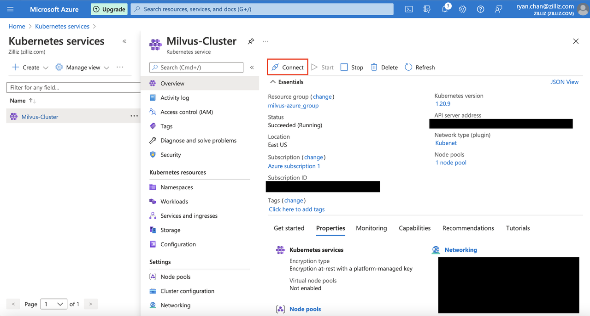

#  Deploy Milvus on Azure With Kubernetes

This topic describes how to deploy Milvus on Azure. This topic uses the [Azure portal](https://docs.microsoft.com/en-us/azure/aks/kubernetes-walkthrough-portal) to create a cluster and uses Azure Kubernetes Service (AKS)
 to provision a Kubernetes cluster. Click [here](https://portal.azure.com/#create/microsoft.aks) to create AKS. (legacy)

 This topic uses Azure Kubernetes Service (AKS) to provision a cluster and uses the Azure portal to create the cluster. 

## Prerequisites

Ensure that your Azure project has been set up properly and you have access to the resources that you want to use. Contact your administrators if you are not sure about your access permission. 
   
### Software requirements
- [Azure CLI](https://docs.microsoft.com/en-us/cli/azure/install-azure-cli#install)
- [kubectl](https://kubernetes.io/docs/tasks/tools/)
- [Helm](https://helm.sh/docs/intro/install/)

Alternatively, you can use the [Cloud Shell](https://shell.azure.com.) which has the Azure CLI, kubectl, and Helm preinstalled.

<div class="alert note">After you install the Azure CLI, ensure that you are properly authenticated.

## Provision a Kubernetes cluster

1. Log on to the [Azure portal](https://portal.azure.com).
2. On the Azure portal menu or from the **Home** page, select **Create a resource**.
3. Select **Containers** > **Kubernetes Service**.
4. On the **Basics** page, configure the following options:

- **Project details**:
  - **Subscription**: Contact your organization's Azure Administrator to determine which subscription you should use.

    - **Resource group**: Contact your organization's Azure Administrator to determine which resource group you should use.

- **Cluster details**:
  - **Kubernetes cluster name**: A cluster name of your own choice.

  - **Region**: A region of your own choice. 

  - **Availability zones**: Pick a number of [availability zones](https://docs.microsoft.com/en-us/azure/aks/availability-zones#overview-of-availability-zones-for-aks-clusters) based on your needs. For production clusters, we recommend you to use multiple availability zones. But for testing purposes, it is unnecessary to use more than one availability zone.

- **Primary node pool**:

  - **Node size**: We strongly recommend choosing a node type with at least **16 GiB of RAM** available. Depending on your data scale, you can also pick a node type with more resources.
  
    <div class="alert note">    
    You may select different machine types to better suit your work case, but we strongly recommend that worker nodes all have at least 16 GB of memory to ensure minimum stable operation.
    </div>

  - **Scale method**: A scaling method of your own choice.

  - **Node count range**: The number of nodes of your own choice.

- **Node pools**:

  - **Enable virtual nodes**: Whether to enable virtual nodes is of your own choice.

  - **Enable virtual machine scale sets**: We recommend choosing `enabled`.

- **Networking**:

  - **Network configuration**: We recommend that you choose `Kubenet`.

  - **DNS name prefix**: A DNS name prefix of your own choice.

  - **Traffic Routing**:

  - **Load balancer**: `Standard`

  - **HTTP application routing**: `Not Needed`


5. After configuring the options, click **Review + create** and then **Create** when validation completes. It takes a few minutes to create the cluster. 


## Deploy Milvus with Helm

After the cluster is created, install Milvus on the cluster with Helm.


### Connect to the cluster

1. Navigate to the cluster that you have created in Kubernetes services and click it.
2. On the left-hand navigation pane, click `Overview`.
3. On the `Overview` page that appears, click `Connect` to view the resource group and subscription.


### Set a subscription and credentials

<div class="alert note">You can use Azure Cloud Shell to perform the following procedures.</div>

1. Run the following command to set your subscription.

```shell
az account set --subscription EXAMPLE-SUBSCRIPTION-ID
```
2. Run the following command to download credentials and configure the Kubernetes CLI to use them.
   
```shell
az aks get-credentials --resource-group YOUR-RESOURCE-GROUP --name YOUR-CLUSTER-NAME
```

<div class="alert note">
Use the same shell for the following procedures. If you switch to another shell, run the preceding commands again.
</div>

### Deploy Milvus

1. Run the following command to add the Milvus Helm chart repository.

```shell
helm repo add milvus https://milvus-io.github.io/milvus-helm/
```

2. Run the following command to update your Milvus Helm chart.

```shell
helm repo update
```

3. Run the following command to install Milvus.

<div class="alert note">
This topic uses the <code>my-release</code> as the release name. Replace it with your release name.
</div>

```shell
helm install my-release milvus/milvus --set service.type=LoadBalancer
```

Starting pods might take several minutes. Run `kubectl get services` to view services. If successful, a list of services is shown as follows.


<div class="alert note">
<code>20.81.111.155</code> in the the <code>EXTERNAL-IP</code> column is the IP address of the load balancer. The default Milvus port is <code>19530</code>.
</div>

## Use Azure Blob Storage

Azure Blob Storage is Azure's version of AWS Simple Storage Service (S3).

MinIO Azure Gateway allows accessing Azure. Essentially, MinIO Azure Gateway translates and forwards all connections to Azure by using APIs. You can use MinIO Azure Gateway instead of a MinIO server.

### Set variables

Set variables before you use MinIO Azure Gateway. Modify the default values as needed.

**Metadata that you must set**

- `minio.azuregateway.enabled`: Must be set to `true` to enable operation.

  -  Default is false. 

- `minio.accessKey`: Name of the Azure storage account to use.

- `minio.secretKey`: Access key for the Azure storage account.

- `externalAzure.bucketName`: Name of the Azure storage bucket to use. Unlike S3/MinIO buckets, Azure buckets must be *globally* unique. Therefore the default value is unset.

  - Default is unset.

- `accesskey`: The MinIO access key.
- `secretkey`: The MinIO secret key.
- `gcs_key.json`: The GCP service account credentials file.


Option|Description|Default|
|:---|:---|:---|
|`minio.azuregateway.enabled`|Set the value to ```true``` to enable MinIO Azure Gateway.|`false`|
|`minio.accessKey`|The MinIO access key.|`""`|
|`minio.secretKey`|The MinIO secret key.|`""`|
|`externalAzure.bucketName`|The name of the Azure bucket to use. Unlike an S3/MinIO bucket, an Azure bucket must be globally unique.|`""`|

**Metadata that should be left as default**

- `minio.azuregateway.replicas`: Number of replica nodes to use for the Azure gateway. We highly recommend using only one replica node because MinIO does not have good support for higher numbers. 

  - Default is 1.

- You should also inherit all of the normal MinIO metadata variables.

Example helm install:

```shell
helm install my-release ./milvus --set cluster.enabled=true --set service.type=LoadBalancer --set minio.persistence.enabled=false --set externalAzure.bucketName=milvusbuckettwo --set minio.azuregateway.enabled=true --set minio.azuregateway.replicas=1 --set minio.accessKey=milvusstorage --set minio.secretKey=your-azure-key
```
## What's next

If you want to learn how to deploy Milvus on other clouds:
- [Deploy a Milvus Cluster on EC2](https://milvus.io/docs/v2.0.0/aws.md)
- [Deploy a Milvus Cluster on EKS](https://milvus.io/docs/v2.0.0/eks.md)
- [Deploy a Milvus Cluster on GCP](https://milvus.io/docs/v2.0.0/gcp.md)
