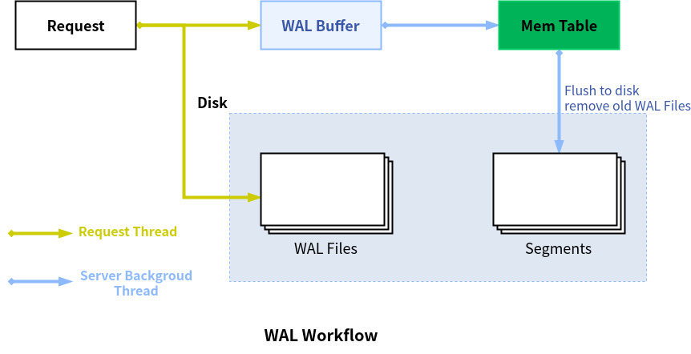

# Write Ahead Log

Write ahead log records the insertion and deletion requests into the log file, and then the background thread writes it to the system. Once the requests are successfully written to the log file, the server returns success. This function enhances data reliability and reduce client blocking.

## Data reliability

Write ahead log guarantees the atomicity of modification requests. All requests that receives success messages are completely written to the system. For requests that do not receive and respondence due to an unexpected system exit or an unexpected link disconnection, the operation is either succeed or fail. Whether the operation is successful can be confirmed by calling other interfaces. In addition, when the system restarts, some requests in the log file are re-executed if they have not been applied to the system state.

## Buffer settings

The buffer size of the write ahead log is determined by the `wal.buffer_size`. To ensure the write performance of the write ahead log, it is recommended to set the buffer size to at least twice the size of the data imported in a single batch.

For how to set <code>wal.buffer_size</code>, see <a href="configuration.md">Milvus configuration</a>.

## Delete old log files

Milvus automatically deletes log files that have been applied to the system.
