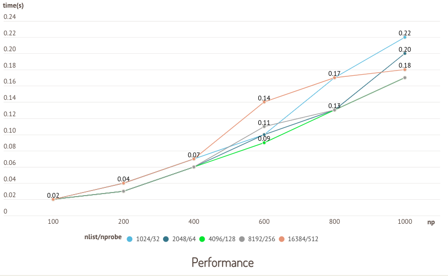

# Install and Start Milvus

{{tab}} 

## Prerequisites

#### Operating system requirements

| Operating system | Supported versions                              |
| :--------------- | :----------------------------------------------------------- |
| CentOS           | 7.5 or higher                                                |
| Ubuntu LTS       | 18.04 or higher                                              |

#### Hardware requirements

| Component | Recommended configuration             |
| ---------- | ------------------------------------- |
| CPU        | Intel CPU Sandy Bridge or higher. |
| CPU instruction set | <ul><li>SSE42</li><li>AVX</li><li>AVX2</li><li>AVX512</li></ul> |
| RAM        | 8 GB or more (depends on the data volume) |
| Hard drive | SATA 3.0 SSD or higher                |

#### Software requirements

| Software     | Version                                |
| ------- | -------------------------------------- |
| Docker  | 19.03 or higher                             |

<div class="alert note">
Please ensure that the available memory is greater than the sum of <code>cache.insert_buffer_size</code> and <code>cache.cache_size</code> set in the <b>server_config.yaml</b> file.
</div>

## Confirm Docker status

Confirm that the Docker daemon is running in the background:

```shell
$ sudo docker info
```

<div class="alert note">
<ul>
<li>If you do not see the server listed, start the Docker daemon.</li>
<li>On Linux, Docker needs <code>sudo</code> privileges. To run Docker commands without <code>sudo</code> privileges, create a <code>docker</code> group and add your users (see <a href="https://docs.docker.com/install/linux/linux-postinstall/">Post-installation steps for Linux</a> for details).</li>
</ul>
</div>

## Pull Docker image

Pull the CPU-only image:

```shell
$ sudo docker pull milvusdb/milvus:{{var.cpu_milvus_docker_image_version}}
```
{{fragments/tar_workaround.md}}


## Download configuration files

```shell
$ mkdir -p /home/$USER/milvus/conf
$ cd /home/$USER/milvus/conf
$ wget https://raw.githubusercontent.com/milvus-io/milvus/{{var.release_version}}/core/conf/demo/server_config.yaml
```

<div class="alert note">
If you cannot download configuration files via the <code>wget</code> command, you can create a <b>server_config.yaml</b> file under <b>/home/$USER/milvus/conf</b>, and then copy the content from <a href="https://github.com/milvus-io/milvus/blob/{{var.release_version}}/core/conf/demo/server_config.yaml">server config</a> to it.
</div>

## Start Docker container

Start Docker container and map the paths to the local files to the container:

```shell
$ sudo docker run -d --name milvus_cpu_{{var.release_version}} \
-p 19530:19530 \
-p 19121:19121 \
-v /home/$USER/milvus/db:/var/lib/milvus/db \
-v /home/$USER/milvus/conf:/var/lib/milvus/conf \
-v /home/$USER/milvus/logs:/var/lib/milvus/logs \
-v /home/$USER/milvus/wal:/var/lib/milvus/wal \
milvusdb/milvus:{{var.cpu_milvus_docker_image_version}}
```

The `docker run` options used in the above command are defined as follows:

- `-d`: Runs container in the background and prints container ID.
- `--name`: Assigns a name to the container.
- `-p`: Publishes a container’s port(s) to the host.
- `-v`: Mounts the directory into the container.

Confirm the running state of Milvus:

```shell
$ sudo docker ps
```

If the Milvus server does not start up properly, check the error logs:

```shell
$ sudo docker logs milvus_cpu_{{var.release_version}}
```

## FAQ

<details>
<summary><font color="#4fc4f9">Can I install Milvus on Windows?</font></summary>
{{fragments/faq_install_windows.md}}
</details>
<details>
<summary><font color="#4fc4f9">Why does Milvus return <code>Illegal instruction</code> during startup?</font></summary>
{{fragments/faq_illegal_instruction_set.md}}
</details>
<details>
<summary><font color="#4fc4f9">How to migrate data in Milvus?</font></summary>
{{fragments/faq_data_migration.md}}
</details>
<details>
<summary><font color="#4fc4f9">Is Docker the only way to install and run Milvus?</font></summary>
{{fragments/faq_install_from_source.md}}
</details>
<details>
<summary><font color="#4fc4f9">How to set <code>nlist</code> or <code>nprobe</code> for IVF indexes?</font></summary>
In general terms, the recommended value of <code>nlist</code> is <code>4 &times; sqrt(n)</code>, where n is the total number of entities in a segment. 

Determining `nprobe` is a trade-off between search performance and accuracy, and based on your dataset and scenario. It is recommended to run several rounds of tests to determine the value of `nprobe`.

The following charts are from a test running on the sift50m dataset and IVF\_SQ8 index. The test compares search performance and recall rate between different `nlist`/`nprobe` pairs.

<div class="alert note">

We only show the results of GPU-enabled Milvus here, because the two distributions of Milvus show similar results.

</div>


Key takeaways: This test shows that the recall rate increases with the `nlist`/`nprobe` pair.



Key takeaways: When `nlist` is 4096 and `nprobe` 128, Milvus shows the best search performance.

</details>


## What's next

- If you're just getting started with Milvus:

  - [Try an example program](example_code.md)
  - [Learn basic Milvus operations](connect_milvus_python.md)
  - [Try Milvus Bootcamp](https://github.com/zilliz-bootcamp)
  
- If you're ready to run Milvus in production:

  - Build a [monitoring and alerting system](monitor.md) to check real-time application performance.
  - Tune Milvus performance through [configuration](milvus_config.md).
  
- If you want to use GPU-accelerated Milvus for search in large datasets:
  
  - [Install GPU-enabled Milvus](milvus_docker-gpu.md)
