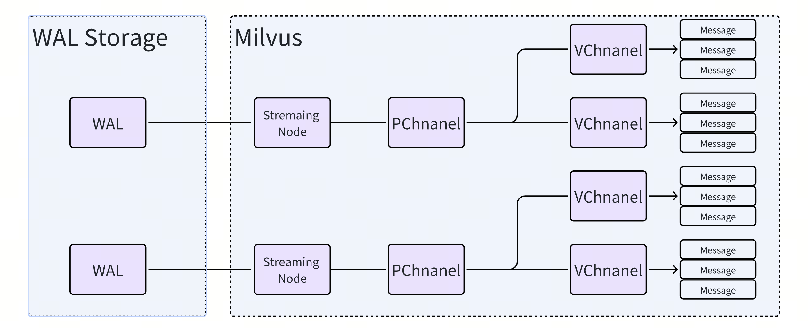
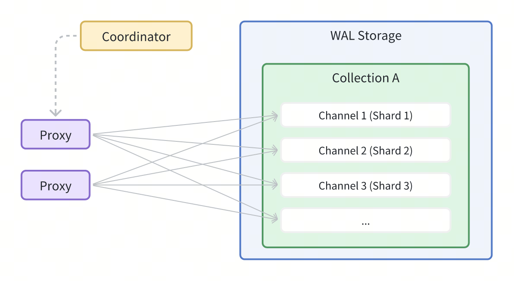
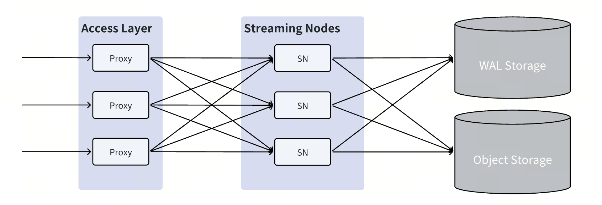
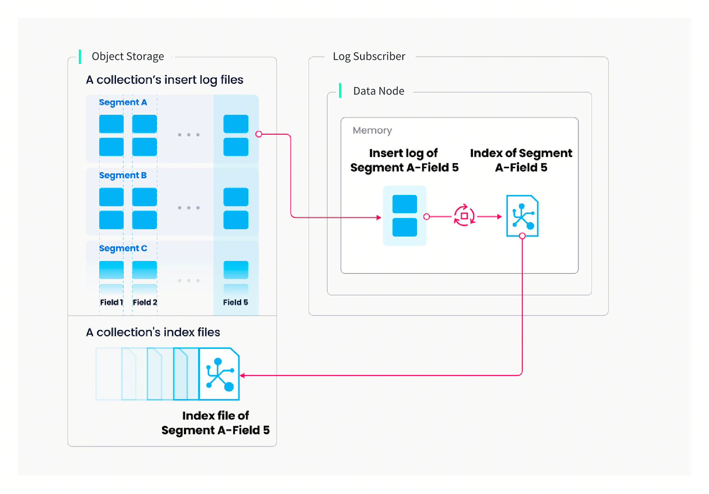
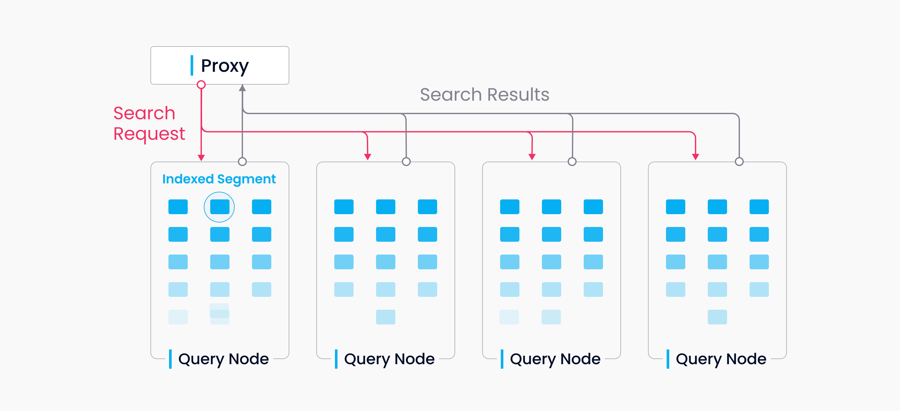
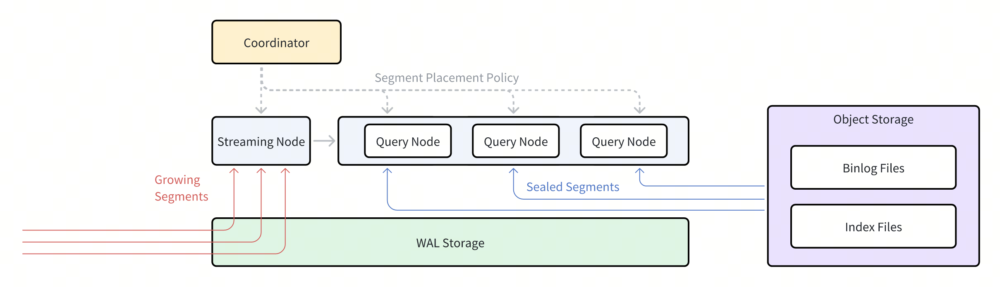

# Data Processing

This article provides a detailed description of the implementation of data insertion, index building, and data query in Milvus.

## Data insertion

You can specify a number of shards for each collection in Milvus, each shard corresponding to a virtual channel (*vchannel*). As the following figure shows, Milvus bind each vchannel with a physical channel (*pchannel*), and pchannel will bind with determined streaming node.

After data verification, the proxy will split the written message into various data package of shards according to the specified shard routing rules. 

Then the written data of one **shard (vchannel)** is sent to the corresponding streaming node of pchannel.

The streaming node will bind a TSO (Timestamp Orcale) to each data package to determine the order of operation, check the consistency checks of written data and writing to the underlying WAL. Written data will no longer be lost after writing into WAL, streaming node will recover the data from wal from crash.

Meanwhile, streaming node will asynchronously split the written data into a series of segments, there are two different segments:

- **growing segment**: any data that has not been presisted into the object storage.
- **sealed segment**: all data has been persisted into the object storage, the data of sealed segment is immutable.

The moment when a growing segment is converted into a sealed segment is called a flush. Streaming node will flush a growing segment when there's no more data of these data can be read from underlying wal.

## Index building

Index building is performed by data node. To avoid frequent index building for data updates, a collection in Milvus is divided further into segments, each with its own index.

Milvus supports building index for each vector field, scalar field and primary field. Both the input and output of index building engage with object storage: The data node loads the log snapshots to index from a segment (which is in object storage) to memory, deserializes the corresponding data and metadata to build index, serializes the index when index building completes, and writes it back to object storage.

Index building mainly involves vector and matrix operations and hence is computation- and memory-intensive. Vectors cannot be efficiently indexed with traditional tree-based indexes due to their high-dimensional nature, but can be indexed with techniques that are more mature in this subject, such as cluster- or graph-based indexes. Regardless its type, building index involves massive iterative calculations for large-scale vectors, such as Kmeans or graph traverse.

Unlike indexing for scalar data, building vector index has to take full advantage of SIMD (single instruction, multiple data) acceleration. Milvus has innate support for SIMD instruction sets, e.g., SSE, AVX2, and AVX512. Given the "hiccup" and resource-intensive nature of vector index building, elasticity becomes crucially important to Milvus in economical terms. Future Milvus releases will further explorations in heterogeneous computing and serverless computation to bring down the related costs. 

Besides, Milvus also supports scalar filtering and primary field query. It has inbuilt indexes to improve query efficiency, e.g., Bloom filter indexes, hash indexes, tree-based indexes, and inverted indexes, and plans to introduce more external indexes, e.g., bitmap indexes and rough indexes. 

## Data query

Data query refers to the process of searching a specified collection for *k* number of vectors nearest to a target vector or for *all* vectors within a specified distance range to the vector. Vectors are returned together with their corresponding primary key and fields. 

A collection in Milvus is split into multiple segments, the streaming node loads growing segment and maintain the real-time growing data, the query nodes loads sealed segment. 
When a query/search request arrives, proxy broadcast the request to all streaming node related shard lateds for concurrent search.
When a query request arrives, the proxy concurrently requests the streaming node where the cooresponding shards are located.
The streaming node generates a query plan and queries growing data on this node, as well as requests remote query nodes to query historical data, then redunce all the results into query result of a single shard.
Finally, the proxy collects all shard results and reduces them to the final result and retruns.

When the growing segment on streaming node is flushed into a seald segment or data node complete a compaction. A *handoff* operation initiated by coordinator turns growing data to historical data. Coordinator will distribute sealed segments evenly among all query nodes according to memory usage, CPU overhead, and segment number and release the redundant segment.

## What's next

- Learn about how to [use the Milvus vector database for real-time query](https://milvus.io/blog/deep-dive-5-real-time-query.md).
- Learn about [data insertion and data persistence in Milvus](https://milvus.io/blog/deep-dive-4-data-insertion-and-data-persistence.md).
- Learn how [data is processed in Milvus](https://milvus.io/blog/deep-dive-3-data-processing.md).

