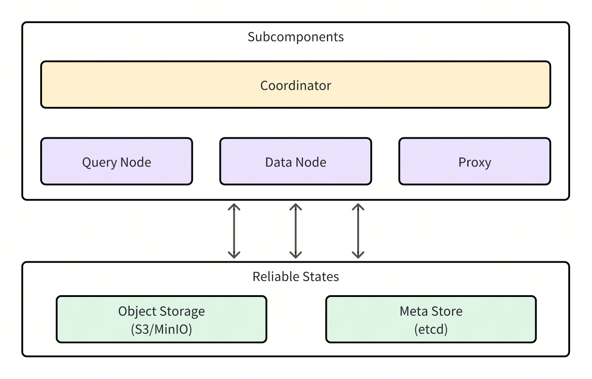
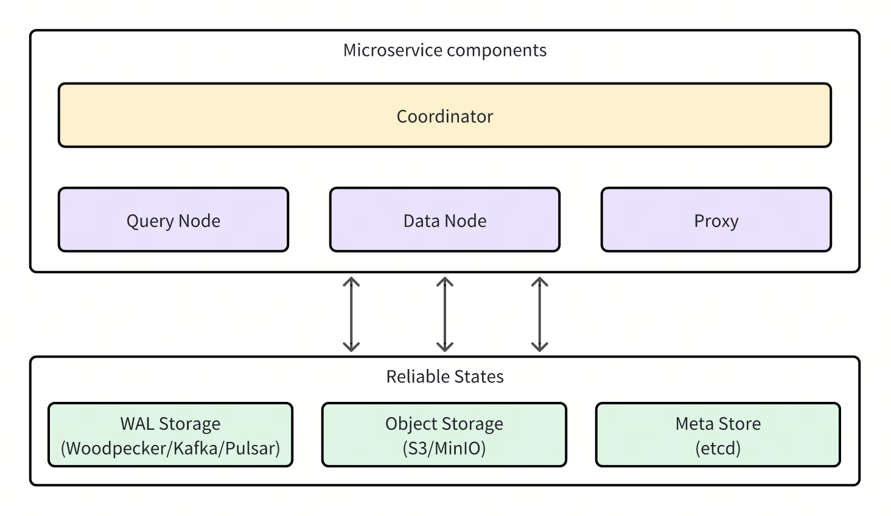

# Main Components

**Milvus cluster** includes four components and three third-party dependencies. All component can be deployed on Kubernetes, independently from each other. 

## Milvus components

- Coordinator: Exactly one
- Proxy: At least one
- Streaming node: At least one
- Query node: At least one
- Data node: At least one

## Third-party dependencies

- **Meta Store:** Stores metadata for various components in the milvus, e.g. etcd.
- **Object Storage:**  Responsible for data persistence of large files in the milvus, such as index and binary log files, e.g. S3
- **WAL Storage:** Provides Write-Ahead Log (WAL) service for the milvus, e.g. woodpecker. 
    - Under the woodpecker zero-disk mode, **WAL** directly use object storage and meta storage without other deployment, reducing third-party dependencies.

## Milvus deployment modes

There are two modes for running Milvus: 

### Standalone 

A single instance of Milvus that runs all components in one process, which is suitable for small datasets and low workload.
Additionally, in standalone mode, simpler WAL implementation, such as woodpecker and rocksmq, can be chosen to eliminate the requirement for third-party WAL Storage dependencies.

For now, Milvus standalone cannot be upgraded "online" to Milvus cluster if the WAL Storage support the cluster mode.

### Cluster

A distributed deployment mode of Milvus where each component runs independently and can be scaled out to provide elasticity. This setup is suitable for large datasets and high-load scenarios.

## What's next

- Read [Computing/Storage Disaggregation](four_layers.md) to understand the mechanism and design principle of Milvus.
