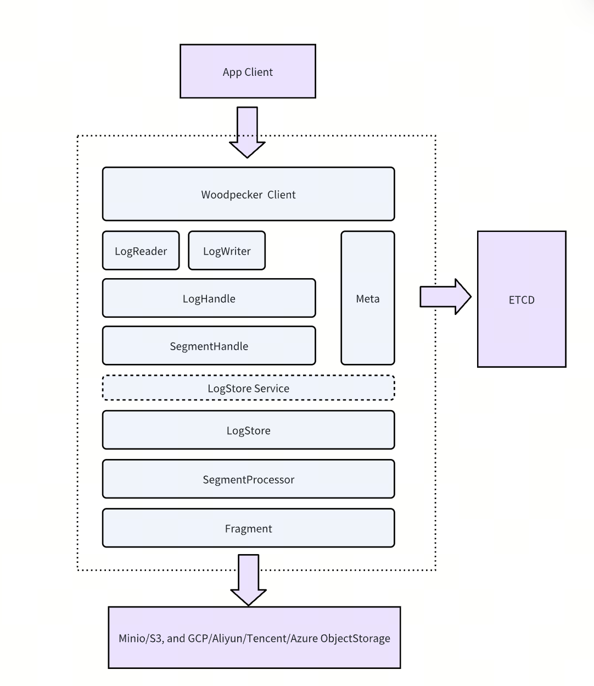
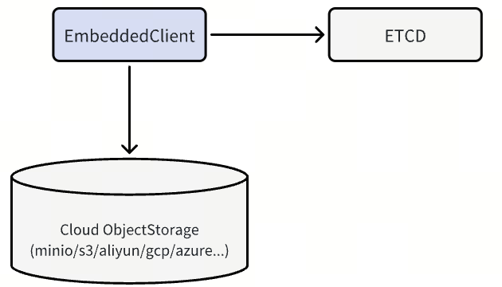

# Introduce

In Milvus 2.6, we've replaced Kafka/Pulsar with Woodpecker, a purpose-built, cloud-native WAL system. Designed for object storage, Woodpecker simplifies operations while boosting performance and scalability.

Woodpecker is built from the ground up to maximize the potential of cloud-native storage, with a focused goal: to become the highest-throughput WAL solution optimized for cloud environments while delivering the core capabilities needed for an append-only write-ahead log.

**The Zero-Disk Architecture for Woodpecker**

Woodpecker's core innovation is its Zero-Disk architecture:

- All log data stored in cloud object storage (such as Amazon S3, Google Cloud Storage, or Alibaba OS)
- Metadata managed through distributed key-value stores like etcd
- No local disk dependencies for core operations

# Architecture Components

A standard Woodpecker deployment includes the following components.

- Client – Interface layer for issuing read and write requests
- LogStore – Manages high-speed write buffering, asynchronous uploads to storage, and log compaction
- Storage Backend – Supports scalable, low-cost storage services such as S3, GCS, and file systems like EFS
- ETCD – Stores metadata and coordinates log state across distributed nodes

# Flexible Deployments to Match Your Specific Needs

Woodpecker offers two deployment modes to match your specific needs:

MemoryBuffer Mode – Lightweight and Maintenance-Free

MemoryBuffer Mode provides a simple and lightweight deployment option where Woodpecker temporarily buffers incoming writes in memory and periodically flushes them to a cloud object storage service. Metadata is managed using etcd to ensure consistency and coordination. This mode is best suited for batch-heavy workloads in smaller-scale deployments or production environments that prioritize simplicity over performance, especially when low write latency is not critical.

QuorumBuffer Mode – Optimized for Low-Latency, High-Durability Deployments

QuorumBuffer Mode is designed for latency-sensitive, high-frequency read/write workloads requiring both real-time responsiveness and strong fault tolerance. In this mode, Woodpecker functions as a high-speed write buffer with three-replica quorum writes, ensuring strong consistency and high availability.

A write is considered successful once it's replicated to at least two of the three nodes, typically completing within single-digit milliseconds, after which the data is asynchronously flushed to cloud object storage for long-term durability. This architecture minimizes on-node state, eliminates the need for large local disk volumes, and avoids complex anti-entropy repairs often required in traditional quorum-based systems.

The result is a streamlined, robust WAL layer ideal for mission-critical production environments where consistency, availability, and fast recovery are essential.

# Performance Benchmarks

We ran comprehensive benchmarks to evaluate Woodpecker's performance in a single-node, single-client, single-log-stream setup. The results were impressive when compared to Kafka and Pulsar:

| System     | Kafka      | Pulsar  | WP Minio | WP Local | WP S3   |
| ---------- | ---------- | ------- | -------- | -------- | ------- |
| Throughput | 129.96MB/s | 107MB/s | 71MB/s   | 450MB/s  | 750MB/s |
| latency    | 58ms       | 35ms    | 184ms    | 1.8ms    | 166ms   |

For context, we measured the theoretical throughput limits of different storage backends on our test machine:

- MinIO: ~110 MB/s
- Local file system: 600–750 MB/s
- Amazon S3 (single EC2 instance): up to 1.1 GB/s

Remarkably, Woodpecker consistently achieved 60-80% of the maximum possible throughput for each backend—an exceptional efficiency level for middleware.

**Key Performance Insights**

- Local File System Mode: Woodpecker achieved 450 MB/s—3.5× faster than Kafka and 4.2× faster than Pulsar—with ultra-low latency at just 1.8 ms, making it ideal for high-performance single-node deployments.
- Cloud Storage Mode (S3): When writing directly to S3, Woodpecker reached 750 MB/s (about 68% of S3's theoretical limit), 5.8× higher than Kafka and 7× higher than Pulsar. While latency is higher (166 ms), this setup provides exceptional throughput for batch-oriented workloads.
- Object Storage Mode (MinIO): Even with MinIO, Woodpecker achieved 71 MB/s—around 65% of MinIO's capacity. This performance is comparable to Kafka and Pulsar but with significantly lower resource requirements.

Woodpecker is particularly optimized for concurrent, high-volume writes where maintaining order is critical. And these results only reflect the early stages of development—ongoing optimizations in I/O merging, intelligent buffering, and prefetching are expected to push performance even closer to theoretical limits.

# Operational Advantages

Woodpecker's cloud-native architecture offers significant operational advantages, simplifying deployment, reducing maintenance costs, and enhancing system reliability. Here are the operational benefits of Woodpecker:

## Simplified Infrastructure Management

**Advantages of Zero-Disk Architecture**

- **No Local Storage Management**: Eliminates the complexity of managing local disk volumes, RAID configurations, and disk failure scenarios.
- **Reduced Hardware Dependency**: No need to configure, monitor, or replace storage hardware—cloud object storage handles durability and availability.
- **Simplified Capacity Planning**: Storage automatically scales with cloud object storage, eliminating complex disk space forecasting needs.

**Simplified Deployment Modes**

- **MemoryBuffer Mode**: Minimal resource usage with automatic cloud storage integration—ideal for development and small production environments.
- **QuorumBuffer Mode**: Enterprise-level reliability without the operational complexity of traditional distributed storage systems.

## Cost Efficiency and Resource Optimization

**Optimized Resource Utilization**

- **Lower Memory Usage**: Efficient buffering strategies reduce memory requirements compared to traditional message brokers.
- **Elastic Scaling**: Pay-as-you-go cloud storage model eliminates over-provisioning costs.
- **Reduced Infrastructure Overhead**: Fewer components to deploy, monitor, and maintain, translating to lower operational costs.

**Storage Cost Advantages**

- **Tiered Storage Strategy**: Automatically migrates to cost-effective cloud storage tiers for long-term retention.
- **Compression and Deduplication**: Built-in optimizations reduce storage costs without increasing operational overhead.
- **No Replication Overhead**: Cloud storage handles durability, eliminating the need for manual replica management.

## High Availability and Disaster Recovery

**Simplified Fault Tolerance**

- **Cloud-Native Durability**: Leverages cloud providers' 99.999999999% (11 nines) durability guarantee.
- **Fast Recovery**: Minimal local state means faster node replacement and cluster recovery.
- **Cross-Region Resilience**: Easily set up cross-region replication using cloud storage capabilities.

**Operational Resilience**

- **Reduced Single Points of Failure**: Fewer components mean fewer potential failure modes.
- **Automatic Failover**: Built-in cloud storage redundancy eliminates complex failover procedures.
- **Simplified Backup Strategy**: Cloud storage integration provides automatic backup and versioning features.

## Development and Operational Experience

**Improved Development Workflow**

- **Faster Environment Setup**: Minimal dependencies accelerate development and testing cycles.
- **Consistent Behavior**: Maintains the same architecture across development, pre-production, and production environments.
- **Cloud-Native Integration**: Native compatibility with cloud services and container orchestration platforms.

**Enhanced Production Operations**

- **Predictable Performance**: Consistent behavior across different deployment scales and configurations.
- **Simplified Upgrades**: Stateless design minimizes downtime during rolling updates.
- **Better Resource Predictability**: More predictable resource consumption patterns compared to traditional message brokers.

For vector databases supporting mission-critical RAG, AI agents, and low-latency search workloads, these operational advantages are revolutionary. Transitioning from complex message broker stacks to Woodpecker's simplified architecture not only boosts performance but also significantly reduces the operational burden on development and infrastructure teams.

As cloud infrastructure continues to evolve with innovations like S3 Express One Zone, Woodpecker's architecture enables organizations to automatically benefit from these advancements without requiring major operational changes or system redesigns.
