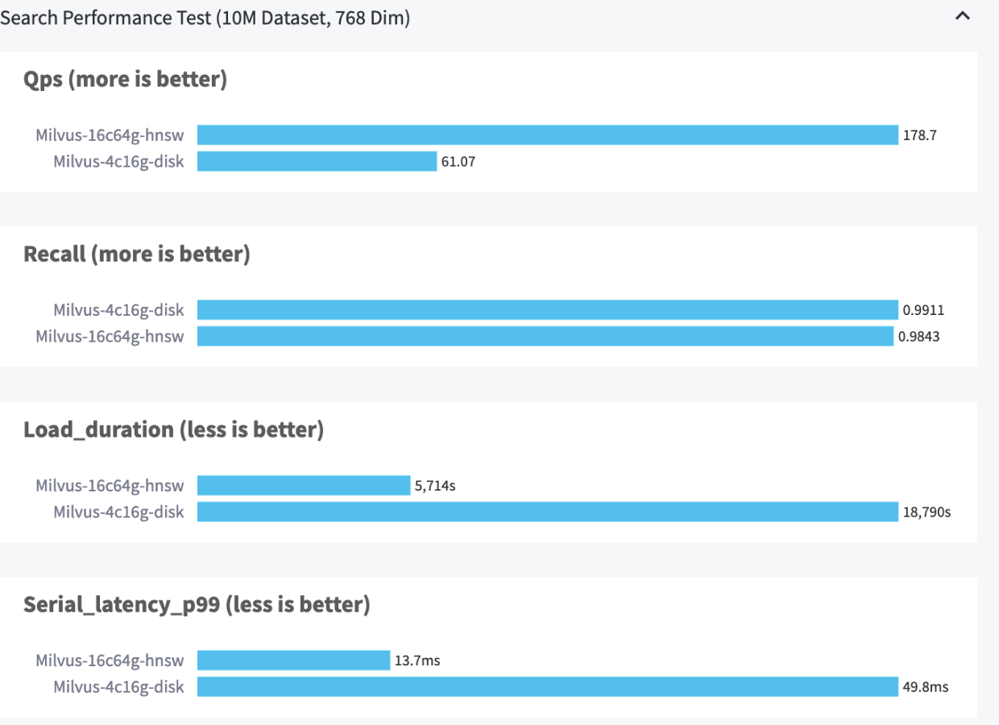
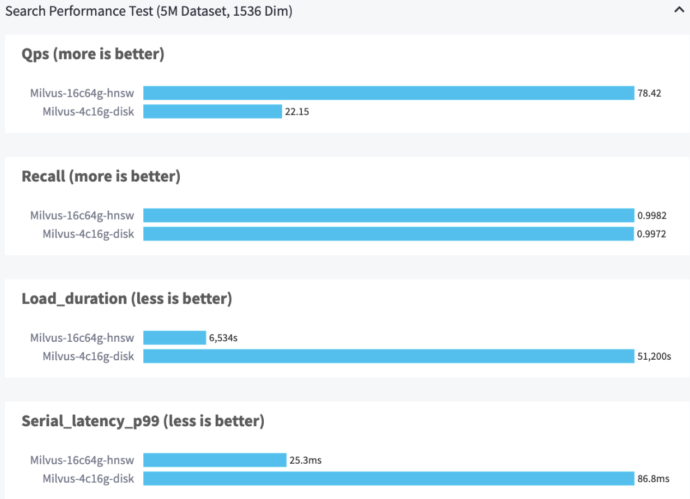
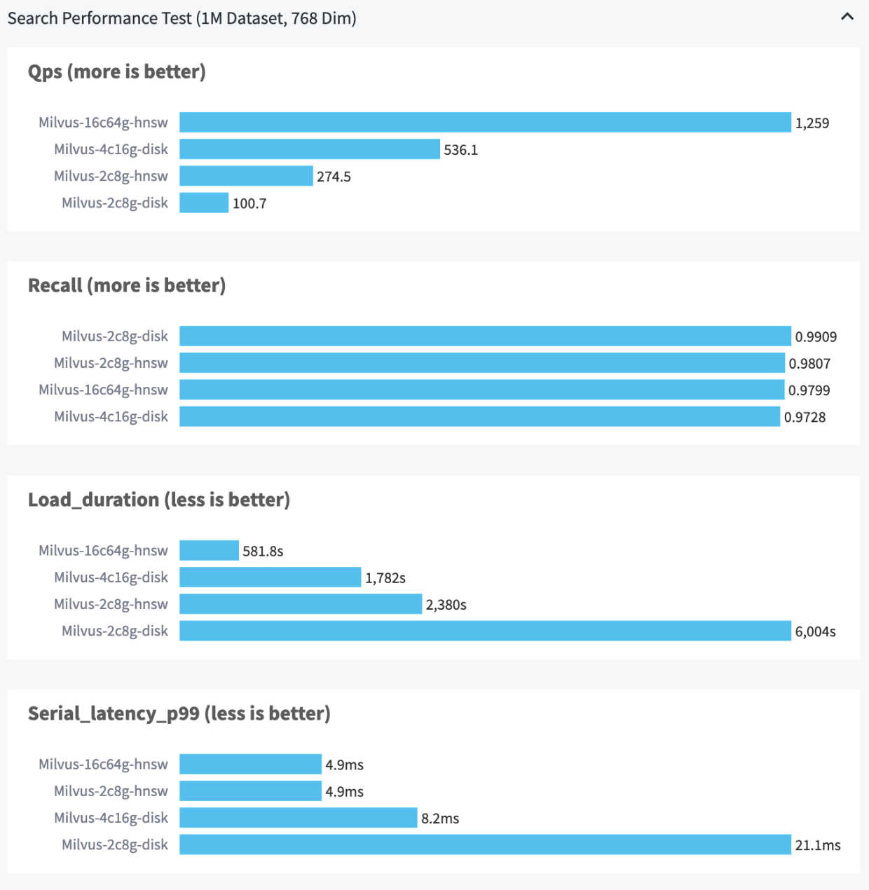
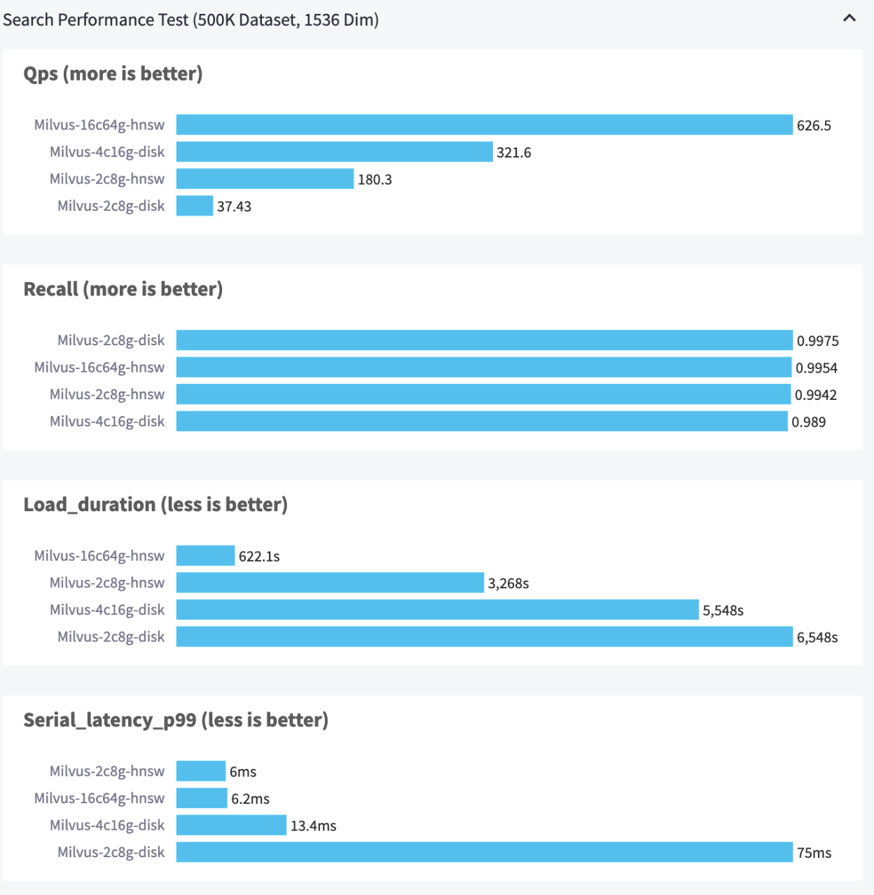

# Milvus Benchmark Test Report

This report shows the major test results of Milvus 2.2.12. It aims to provide a picture of Milvus search performance in various aspects.

  

      

        
      

      

        
Factors that might influence Milvus performance include:

        <ul>
          <li>Network conditions (latency, bandwidth, etc.)</li>
          <li>Size of data (number of vectors, dimensionality, etc.)</li>
          <li>Database configurations (index type, index parameters, etc.)</li>
          <li>Other environmental factors (OS, hardware, etc.)</li>
        </ul>
      

  

  

    
For details, welcome referring to <a href="https://zilliz.com/resources/whitepaper/milvus-performance-benchmark">this whitepaper</a> and <a href="https://github.com/zilliztech/VectorDBBench">related benchmark test code</a>. 

  

## Terminology

    
Click to see the details of the terms used in the test

    <table class="terminology">
        <thead>
            <tr>
                <th>Term</th>
                <th>Description</th>
            </tr>
        </thead>
        <tbody>
            <tr>
                <td>nq</td>
                <td>Number of vectors to be searched in one search request</td>
            </tr>
            <tr>
                <td>topk</td>
                <td>Number of the nearest vectors to be retrieved for each vector (in nq) in a search request</td>
            </tr>
            <tr>
                <td>ef</td>
                <td>A search parameter specific to <a href="https://milvus.io/docs/v2.2.x/index.md">HNSW index</a></td>
            </tr>
            <tr>
                <td>RT</td>
                <td>Response time from sending the request to receiving the response</td>
            </tr>
            <tr>
                <td>QPS</td>
                <td>Number of search requests that are successfully processed per second</td>
            </tr>
        </tbody>
    </table>

## Test environment

All tests are performed under the following environments.

### Hardware and deployment

| Machine         | vCPUs | Memory (GB) | Milvus Index Type |
|-----------------|-------|-------------|-------------------|
| Amazon EC2 M6id | 16    | 64          | HNSW              |
| Amazon EC2 M6id | 4     | 16          | DISK_ANN          |
| Amazon EC2 M6id | 2     | 8           | HNSW              |
| Amazon EC2 M6id | 2     | 8           | DISK_ANN          |

### Datasets tested

| Datasets      | Dimensions | Data Type | Distance          | Size (vectors) |
|---------------|------------|-----------|-------------------|----------------|
| Cohere Medium | 768        | Float 32  | Cosine Similarity | 1 M            |
| OpenAI Medium | 1,536      | Float 32  | Cosine Similarity | 500 K          |
| Cohere Large  | 768        | Float 32  | Cosine Similarity | 10 M           |
| OpenAI Large  | 1,536      | Float 32  | Cosine Similarity | 5M             |

### Metrics

 - Throughput: A vector database’s capability to handle concurrent queries per second (QPS). Higher QPS values indicate better vector database performance.
- Recall Rate: Vector search accuracy of a vector database. Higher recall rates correspond to more accurate vector search results. When the recall rate is:
  - **≥ 0.95**: High Accuracy 
  - **Between 0.9-0.95**: Medium Accuracy
  - **＜0.95**: Low Accuracy
- P99 Latency: The time that 99% of queries take to complete. Lower latency values indicate better vector database performance. 

### Evaluation Tools

We utilized [VectorDBBench](https://github.com/zilliztech/VectorDBBench), an open-source benchmarking tool designed specifically for vector databases, in this performance test. VectorDBBench enables users to rigorously test and compare the performance of various vector database systems, providing valuable insights to identify the most suitable database for their specific use case. By leveraging VectorDBBench, users can base their decisions on actual performance metrics rather than marketing claims or anecdotal evidence, ensuring a more informed and reliable choice.

## Benchmarking results

In this performance test, we used VectorDBBench to evaluate Milvus's throughput, latency, and recall rate when it conducted a vector search. We used two large and two medium-sized datasets from OpenAI and Cohere for our evaluation. 

### Large-size datasets tested (≥5M vectors)

- Cohere Large 10,000,000 vectors (768 dimensions, float32)
- OpenAI Large 500,000 vectors (1,536 dimensions, float32)

#### Milvus configuration

- **Milvus-16c64g-hnsw**: Milvus with 16 vCPUs and 64G of RAM using HNSW index
- **Milvus-4c16g-disk**: Milvus with 4 vCPUs and 16G of RAM using DISK_ANN index

#### Performance results

### Medium-size datasets tested (<5M vectors)

- Cohere Medium 1,000,000 vectors (768 dimensions, float32)
- OpenAI Medium 500,000 vectors (1,536 dimensions, float32)

#### Milvus configuration

- **Milvus-2c8g-hnsw**: Milvus with 2 vCPUs and 8G of RAM using HNSW index
- **Milvus-2c8g-disk**: Milvus with 2 vCPUs and 8G of RAM using DISK_ANN index

#### Performance results

