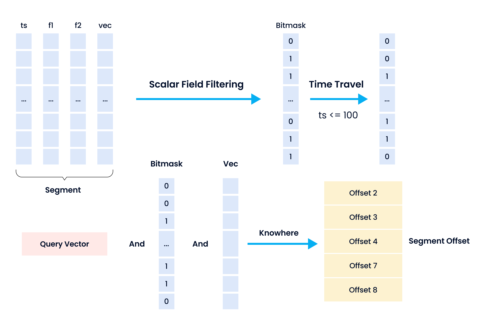

# Time Travel

This topic introduces the Time Travel feature in detail. See Search with Time Travel for more information about how to use this feature.

## Overview

Time Travel is a feature that allows you to access historical data at any point within a specified time period, making it possible to query, restore, and back up data in the past.  With Time Travel, you can:

- Search or query data that has been deleted.

- Restore data that has been deleted or updated.

- Back up data before a specific point of time.

Unlike traditional databases that use snapshots or retain data to support the Time Travel feature, the Milvus vector database maintains a timeline for all data insert or delete operations and adopts a timestamp mechanism. This means you can specify the timestamp in a search or query to retrieve data at a specific point of time in the past to significantly reduce maintenance costs.

## Timestamp in Milvus

In the Milvus vector database, each entity has its own timestamp attribute. All data manipulation language (DML) operations including data insertion and deletion, mark entities with a timestamp. For instance, if you inserted several entities all at one go, this batch of data will be marked with timestamps and share the same timestamp value. 

### DML operations

When the proxy receives a data insert or delete request, it also gets a timestamp from the [root coord](https://milvus.io/docs/v2.1.x/four_layers.md#Root-coordinator-root-coord). Then, the proxy adds the timestamp as an additional field to the inserted or deleted data. Timestamp is a data field just like primary key (`pk`). The timestamp field is stored together with other data fields of a collection.

When you load a collection to memory, all data in the collection, including their corresponding timestamps, are loaded into memory.

### Search or query with Time Travel

`travel_timestamp` is a timestamp specified by you to indicate that you need to conduct a query or search on the data view before this point in time. In parallel to a traditional database, you can consider `travel_timestamp` as a data snapshot, and the query or search needs to be conducted on the data in this snapshot. 

During a search, if the search request received by the proxy contains the parameter, `travel_timestamp`, the value of this parameter will be passed to [segcore](https://github.com/milvus-io/milvus/tree/master/docs/design_docs/segcore), the execution engine which supports concurrent insertion, deletion, query, index loading, monitoring and statistics of a segment data in memory. The segcore filters the search results by timestamp. In other words, you can deem the Time Travel feature as data filtering with the condition limited by the value of `travel_timestamp`. This means that data whose timestamp value is greater than `travel_timestamp` are filtered out and will not be involved in the search or query process. The expression for filtering is `data.timestamp <= travel_timestamp`.

## Bitset for timestamp

To go into details, searches and queries with filtering in [knowhere](https://github.com/milvus-io/milvus/blob/master/docs/design_docs/knowhere_design.md) are facilitated by bitset. And the underlying mechanism behind Time Travel is enabled by bitset.

When a search is conducted, the segcore obtains a bitset indicating if the timestamp meets the condition. Then Milvus judges the range of data to query or search based on this bitset.

### Sealed segment

When loading a sealed segment, Milvus loads all the timestamps to memory and the segcore builds an index, `TimestampIndex` , on the timestamp field. The index contains information about the smallest and the largest timestamp value of this sealed segment, the offset and the row number of timestamps in this sealed segment.

When you search with Time Travel, Milvus first filters the sealed segment according to the smallest and largest timestamp in the `TimestampIndex`:

- If the value you set for `travel_timestamp` is greater than the largest timestamp of the segment, this means all the data in this segment meets the requirement. Therefore, the bitset of the data in this segment is marked as 1. 
- If the value you set for `travel_timestamp` is smaller than the smallest timestamp of the segment, this means the data in this segment does not meet the requirement. Therefore, the bitset of the data in this segment is marked as 0.
- If the value you set for `travel_timestamp` is between the largest and the smallest timestamp of the segment, Milvus compares the timestamps in the segment one by one, and generates a bitset accordingly. In the bitset, if the data meet the requirement, they are marked with 1, and 0 if they do not. 

### Growing segment

For growing segments, you do not need to load the collection to memory. All inserted data exists in memory, with the timestamp field attached. Data in growing segments are sorted according to the order of timestamp. When new data are inserted, they are added to the segment in the order of their timestamp. Segment data are organized in segcore memory in the same way. 

When you search with Time Travel, Milvus uses binary search to find the first offset, or the row number data, with their timestamp value greater than the value you set for the `travel_timestamp` parameter. Then subsequent operations including filtering and vector similarity search are conducted within this range of offsets.

## What's next
After learning how Time Travel works in Milvus, you might also want to:

- Learn how to [search with Time Travel](timetravel.md)
- Learn the [architecture](architecture_overview.md) of Milvus.
- Understand [how data are processed](data_processing.md) in Milvus.

