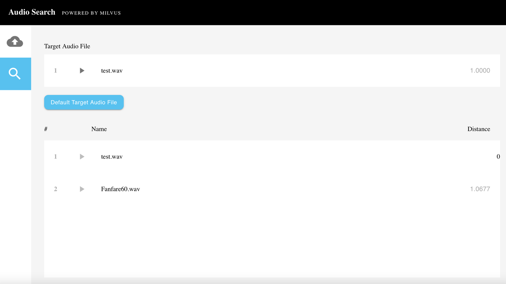

# Audio Similarity Search

This tutorial demonstrates how to use Milvus, the open-source vector database to build an audio similarity search system.
- [Open Jupyter notebook](https://github.com/milvus-io/bootcamp/blob/master/solutions/audio_similarity_search/audio_similarity_search.ipynb)
- [Quick deploy](https://github.com/milvus-io/bootcamp/blob/master/solutions/audio_similarity_search/quick_deploy)
The ML model and third-party software used include:
- PANNs (Large-Scale Pretrained Audio Neural Networks)
- MySQL

 

Speech, music, sound effects, and other types of audio search makes it possible to quickly query massive volumes of audio data and surface similar sounds. Applications of audio similarity search systems include identifying similar sound effects, minimizing IP infringement, and more. Audio retrieval can be used to search and monitor online media in real-time to crack down on infringement of intellectual property rights. It also assumes an important role in the classification and statistical analysis of audio data.

 

In this tutorial, you will learn how to build an audio similarity search system that can return similar sound clips. The uploaded audio clips are converted into vectors using PANNs. These vectors are stored in Milvus which automatically generates a unique ID for each vector. Then users can conduct a vector similarity search in Milvus and query the audio clip data path corresponding to th unique vector ID returned by Milvus.

 

