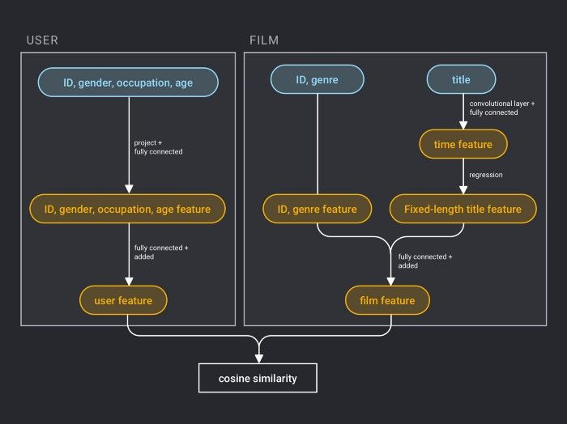

# 推荐系统

推荐系统是信息过滤系统的一个子集，可用于电影、音乐、产品和流媒体推荐等各种场景。推荐系统通过分析和挖掘用户行为，发现用户的个性化需求和兴趣，推荐用户可能感兴趣的信息或产品。与搜索引擎不同，推荐系统不要求用户准确描述他们的需求，而是对他们的历史行为进行建模，以主动提供满足用户兴趣和需求的信息。

 

访问 [github](https://github.com/milvus-io/bootcamp/tree/master/solutions/recommendation_system) 存储库，了解如何使用 Milvus 和 PaddlePaddle 的深度学习框架构建一个 AI 驱动的电影推荐系统。

 

您还可以在 Github 上的 [Bootcamp](https://github.com/milvus-io/bootcamp) 存储库中了解有关如何使用 Milvus 为各种应用场景构建其他系统的更多信息。
