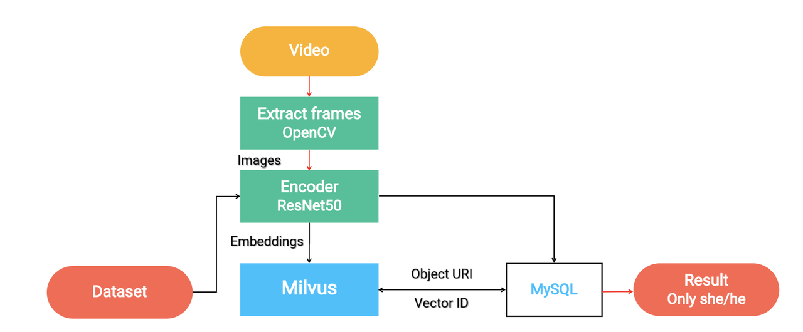

# 视频相似度搜索

像YouTube这样的主要在线视频平台，每分钟接收500小时的用户生成内容，在内容推荐方面提出了独特的需求。 为了做出考虑到新上传的相关实时建议，视频推荐系统必须提供闪电般快速的查询时间和高效的动态数据处理。 通过将关键帧转换为矢量，然后将结果输入Milvus，可以近乎实时地搜索和推荐数十亿个视频。

 

访问 [github repo](https://github.com/milvus-io/bootcamp/tree/master/solutions/video_similarity_search) 学习如何使用Milvus和VGG神经网络构建视频相似性搜索引擎。

 

您还可以在我们的 [bootcamp repo](https://github.com/milvus-io/bootcamp) 中了解更多关于如何使用Milvus为各种应用场景构建其他系统的信息 在Github上。