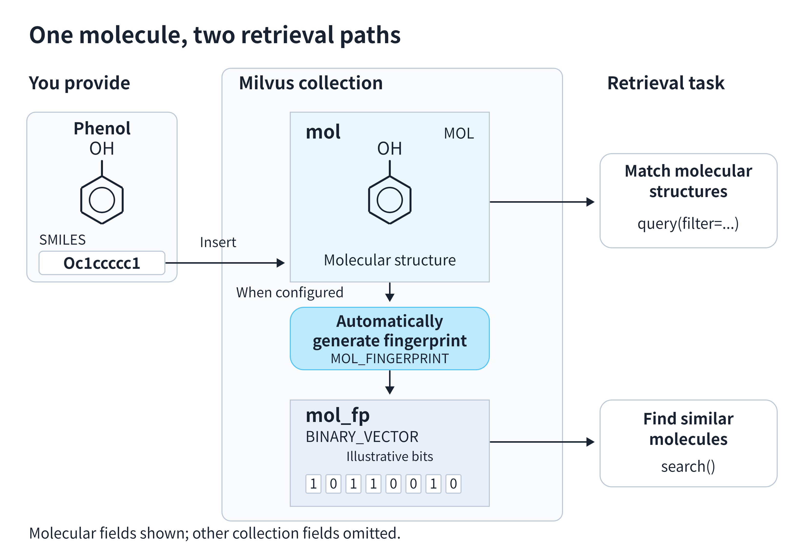

# MOL Field Overview

When working with a molecular library, you may need to find molecules that contain a particular structure, retrieve molecules similar to a reference molecule, or combine both requirements. A `MOL` field stores molecular structures in Milvus. You can query those structures directly or derive molecular fingerprints for similarity search.

Choose a starting point based on your goal:

| Your goal | Start here |
|---|---|
| Understand how molecular data and queries fit together | Continue reading this page |
| Store molecules and prepare a collection for retrieval | [Molecular Search](molecular-search.md) |
| Query structures in a prepared collection | [Query by molecular structure](molecular-search.md#query-by-molecular-structure) |
| Rank molecules in a prepared collection by similarity | [Search for similar molecules](molecular-search.md#search-for-similar-molecules) |

## Molecular data in Milvus

You provide molecules as **SMILES strings**, a common text notation that describes atoms and their bond connections. For example, `Oc1ccccc1` represents phenol. See the [Daylight SMILES manual](https://www.daylight.com/dayhtml/doc/theory/theory.smiles.html) for the notation's syntax and examples.

Milvus stores the molecule in a `MOL` field for structural queries. For similarity search, it can also generate a **molecular fingerprint**: a binary vector summarizing the molecule's structural features. The diagram shows these two paths using the built-in fingerprint function.



*One molecular input supports structural queries and, with fingerprint generation configured, similarity search. The molecular drawings and fingerprint bits are illustrative.*

### Define fields for your retrieval needs

In your collection schema, define a `MOL` field to hold molecular structures:

```python
from pymilvus import DataType

schema.add_field(field_name="mol", datatype=DataType.MOL)
```

If you also need similarity search, add a `BINARY_VECTOR` field for fingerprints. You can generate fingerprints yourself and supply them as [binary vectors](binary-vector.md), or let Milvus generate them from `mol`.

For automatic generation, a **function** in the schema connects the input molecule field to the output fingerprint field. Include the following configuration in the schema before creating the collection:

```python
from pymilvus import Function, FunctionType

# Store the binary fingerprints generated by the function below.
schema.add_field(
    field_name="mol_fp",
    datatype=DataType.BINARY_VECTOR,
    dim=2048,  # Must match fingerprint_size in the function below.
)
schema.add_function(
    Function(
        name="mol_fingerprint",
        # Generate a molecular fingerprint from each input molecule.
        function_type=FunctionType.MOL_FINGERPRINT,
        input_field_names=["mol"],      # Read molecules from this field.
        output_field_names=["mol_fp"],  # Write generated fingerprints here.
        params={
            "fingerprint_type": "morgan",
            "fingerprint_size": "2048",  # Must match mol_fp's dim (in bits).
            "radius": "2",
        },
    )
)
```

The example uses a Morgan fingerprint with 2,048 bits, so `fingerprint_size` matches the output field's `dim`. See [Molecular Fingerprints](mol-fingerprint-function.md) for algorithm and parameter details.

Structural queries do not require `mol_fp` or the function. A collection still needs a primary field and at least one vector field; if you omit `mol_fp`, include another vector field. [Molecular Search](molecular-search.md#create-a-collection) shows a complete collection setup using `mol_fp` for similarity search.

### Insert molecules as SMILES strings

After creating the collection, supply each `MOL` field's value as a string that follows SMILES syntax. For example, the molecular field of an entity containing phenol is:

```json
{"mol": "Oc1ccccc1"}
```

With `MOL_FINGERPRINT` configured, Milvus generates `mol_fp` during insertion. You supply the SMILES value in `mol` and omit the function's output field from the inserted data.

If you generate fingerprints yourself instead, write them to a binary vector field that is not bound as a function output. You are also responsible for generating query fingerprints with the same algorithm and configuration.

### Retrieve molecules for your task

Once the collection is indexed and loaded, the following abbreviated calls show the fields and inputs used for retrieval. `...` marks omitted arguments; [Molecular Search](molecular-search.md) provides complete calls.

For a structural query, refer to `mol` in the filter expression:

```python
client.query(
    ...,
    filter="MOL_CONTAINS(mol, 'c1ccccc1')",  # Match structures in mol.
    output_fields=["mol"],
)
```

For similarity search, target `mol_fp`. With the fingerprint function configured, supply the reference molecule as SMILES; Milvus generates its query fingerprint using the same configuration as the stored fingerprints:

```python
client.search(
    ...,
    anns_field="mol_fp",       # Compare the generated fingerprints.
    data=["Oc1ccccc1"],        # Supply the reference molecule as SMILES.
    output_fields=["mol"],     # Return the matching molecules as SMILES.
)
```

## Structural queries and similarity search

Choose a structural query when a molecular feature must be present. Choose similarity search when you want a ranking relative to a reference molecule. You can also combine the two requirements.

### Find molecules by structure

Suppose you want molecules in your library that contain a benzene ring. This is a condition on molecular structure, not a substring check on the SMILES text. Molecular conditions participate in filtering alongside other scalar conditions.

The `MOL_CONTAINS` operator expresses containment in either direction: **the left argument contains the right argument**. The following expressions illustrate the conditions; they are not complete API calls.

| Condition | Meaning |
|---|---|
| `MOL_CONTAINS(mol, 'c1ccccc1')` | The stored molecule contains the supplied benzene structure. |
| `MOL_CONTAINS('Oc1ccccc1', mol)` | The supplied phenol structure contains the stored molecule. |

The first direction finds molecules containing a required substructure. The reverse direction finds stored molecules that are substructures of the supplied molecule. Each condition produces a match decision, not a similarity score. You can combine the structural condition with other filters, such as whether a compound is available from a supplier.

### Find similar molecules

Suppose you want candidates similar to phenol without requiring a specific substructure. Similarity search compares their fingerprints with the reference fingerprint.

With the `JACCARD` metric, a smaller returned distance indicates greater fingerprint similarity. Results are ranked by that distance. The ranking depends on which structural features the fingerprint algorithm encodes and how the function is configured; it does not prove that a candidate contains a required substructure.

Different molecules can share a fingerprint. Even an identical fingerprint does not establish that two molecular structures are identical.

### Combine structure and similarity

You can require a structure while also ranking candidates by similarity. For example, search for molecules similar to phenol while requiring every result to contain a benzene ring.

In this search, phenol supplies the reference fingerprint for ranking, and benzene supplies the structural condition. Add the `MOL_CONTAINS` condition as a filter to the similarity search. The results must satisfy the condition and are ranked by fingerprint distance.

A structural filter does not add another vector search. The `hybrid_search()` API combines multiple vector search requests and reranks their results; it is not needed for the single fingerprint search described here. See [Multi-Vector Hybrid Search](multi-vector-search.md) for that separate workflow.

## Indexing molecular data

The molecular fields have different index requirements:

| Field | Index | Required? |
|---|---|---|
| `mol` (`MOL`) | `PATTERN` | **Optional.** Accelerates structural containment checks; `MOL_CONTAINS` also works without it. |
| `mol_fp` (`BINARY_VECTOR`), if configured | A binary vector index, such as `BIN_FLAT` or `BIN_IVF_FLAT` | **Required before loading this vector field for similarity search.** Fingerprint generation does not create the index. |

Without `PATTERN`, Milvus checks molecular structures without the index's candidate screening. With `PATTERN`, Milvus first uses pattern signatures to narrow the candidates, then verifies their molecular structures against the condition. Adding the index accelerates the check without changing what the condition means.

The pattern signatures used by `PATTERN` are independent of the similarity fingerprints in `mol_fp`. A `PATTERN` index neither requires nor creates `mol_fp`; each field's index serves its own task.

Omitting `PATTERN` does not remove the collection's vector index requirements. If you use another vector field for a structure-only collection, that field needs its own index before it is loaded. [Molecular Search](molecular-search.md#create-indexes-and-load-the-collection) demonstrates indexing and loading with `mol` and `mol_fp`.

See [PATTERN](pattern.md) for structural index configuration and [Molecular Search](molecular-search.md#create-indexes-and-load-the-collection) for fingerprint index setup.

## Next steps

Follow [Molecular Search](molecular-search.md) to create a collection, insert molecular data, create indexes, and perform structural queries, similarity searches, and combined filtering in one workflow. If you have already completed the guide's shared setup, jump to the corresponding retrieval section.

For detailed rules and configuration, see:

- [Molecular Fingerprints](mol-fingerprint-function.md): function input and output fields, algorithms, and parameters.
- [Molecular Operators](molecular-operators.md): containment syntax, argument direction, and expression rules.
- [PATTERN](pattern.md): structural index configuration and matching behavior.
