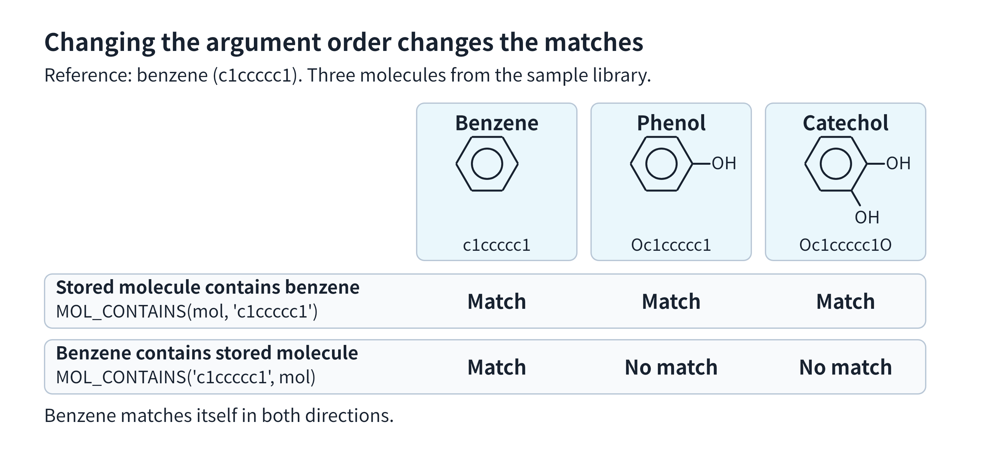

# Molecular Search

Use Milvus to find molecules that contain a required structure, rank molecules by similarity to a reference, or combine both conditions. This guide builds a small molecular library and performs all three tasks on the same collection.

The `mol` field stores molecular structures supplied as SMILES strings. A `MOL_FINGERPRINT` function generates fingerprints in a separate `mol_fp` field for similarity search. For background on these roles, see [MOL Field Overview](mol-field-overview.md).

<div class="alert note">

If your collection already has molecular data and the fields, function, and indexes used in this guide, connect to Milvus, load the collection, and skip to [structural queries](#query-by-molecular-structure), [similarity search](#search-for-similar-molecules), or [combined retrieval](#combine-structure-and-similarity). Adapt the field names and inputs to your collection.

</div>

## Create a collection

Connect to Milvus. Replace the URI with your deployment's endpoint and set `TOKEN` if authentication is enabled. Use an unused collection name.

```python
from pymilvus import DataType, Function, FunctionType, MilvusClient

URI = "http://localhost:19530"
TOKEN = ""
COLLECTION_NAME = "molecular_library"

client = MilvusClient(uri=URI, token=TOKEN)
```

Define a primary key, a display name, and an availability flag alongside the two molecular fields. `name` identifies each molecule in the results. Set `in_stock` to `true` for compounds available in your inventory; you can then retrieve only available compounds that contain a required structure, such as a benzene ring.

```python
schema = client.create_schema(auto_id=False, enable_dynamic_field=False)

schema.add_field(field_name="id", datatype=DataType.INT64, is_primary=True)
schema.add_field(field_name="name", datatype=DataType.VARCHAR, max_length=64)
schema.add_field(field_name="in_stock", datatype=DataType.BOOL)
# highlight-next-line
schema.add_field(field_name="mol", datatype=DataType.MOL)

# Store the binary fingerprints generated from mol.
schema.add_field(
    field_name="mol_fp",
    # highlight-start
    datatype=DataType.BINARY_VECTOR,
    dim=2048,  # Must match the function's fingerprint_size below.
    # highlight-end
)

schema.add_function(
    Function(
        name="mol_fingerprint",
        # highlight-start
        function_type=FunctionType.MOL_FINGERPRINT,  # Generate molecular fingerprints.
        input_field_names=["mol"],                  # Read structures from this MOL field.
        output_field_names=["mol_fp"],              # Write fingerprints to this vector field.
        # highlight-end
        params={
            "fingerprint_type": "morgan",
            "fingerprint_size": "2048",  # Must match mol_fp's dim, in bits.
            "radius": "2",
        },
    )
)

client.create_collection(
    collection_name=COLLECTION_NAME,
    schema=schema,
    consistency_level="Strong",
)
```

The function uses Morgan fingerprints with a radius of `2` and a size of `2048` bits. The output field's `dim` must equal `fingerprint_size`; otherwise, the function configuration is invalid. See [Molecular Fingerprints](mol-fingerprint-function.md) for other configurations.

Milvus requires at least one vector field in a collection. Here, `mol_fp` satisfies that requirement and supports the similarity searches later in the guide. The `Strong` consistency setting lets the subsequent reads see the inserted data.

## Insert molecular data

The sample library contains three molecules with a benzene ring and two without one:

| ID | Molecule | Input SMILES | In stock |
|---|---|---|---|
| 1 | Benzene | `c1ccccc1` | Yes |
| 2 | Phenol | `Oc1ccccc1` | No |
| 3 | Catechol | `Oc1ccccc1O` | Yes |
| 4 | Ethanol | `CCO` | Yes |
| 5 | Acetic acid | `CC(=O)O` | No |

Supply each molecule as a string that follows SMILES syntax in `mol`. Omit `mol_fp`: the configured function fills that field automatically during insertion.

```python
data = [
    {"id": 1, "name": "benzene", "mol": "c1ccccc1", "in_stock": True},
    {"id": 2, "name": "phenol", "mol": "Oc1ccccc1", "in_stock": False},
    {"id": 3, "name": "catechol", "mol": "Oc1ccccc1O", "in_stock": True},
    {"id": 4, "name": "ethanol", "mol": "CCO", "in_stock": True},
    {"id": 5, "name": "acetic acid", "mol": "CC(=O)O", "in_stock": False},
]

insert_result = client.insert(collection_name=COLLECTION_NAME, data=data)
print(insert_result["insert_count"])
```

Check that the insertion count is `5`. Do not supply values for the function's output field yourself.

## Create indexes and load the collection

Create an index for each molecular field:

- `PATTERN` on `mol` accelerates structural containment checks. It is optional for correctness; this example includes it as the recommended setup for structural queries.
- `BIN_FLAT` on `mol_fp` supports fingerprint comparison with the `JACCARD` metric. It needs no clustering parameters and fits this small example. The vector field requires an index before it is loaded.

```python
index_params = client.prepare_index_params()

index_params.add_index(
    field_name="mol",
    # highlight-next-line
    index_type="PATTERN",  # Accelerate structural checks on mol.
)
index_params.add_index(
    field_name="mol_fp",
    # highlight-start
    index_type="BIN_FLAT",
    metric_type="JACCARD",  # Use this distance for fingerprint searches.
    # highlight-end
)

client.create_index(
    collection_name=COLLECTION_NAME,
    index_params=index_params,
)
# Make the collection ready for queries and searches.
client.load_collection(collection_name=COLLECTION_NAME)
```

These synchronous calls wait for index creation and loading to complete. Continue with retrieval after `load_collection()` returns.

The two indexes serve separate purposes. `PATTERN` helps check structures in `mol`; it does not create the similarity fingerprints in `mol_fp`. See [PATTERN](pattern.md) for its configuration.

## Query by molecular structure

To find molecules that contain a benzene ring, use `query()` with a `MOL_CONTAINS` expression in `filter`:

```python
matches = client.query(
    collection_name=COLLECTION_NAME,
    # highlight-next-line
    filter="MOL_CONTAINS(mol, 'c1ccccc1')",
    output_fields=["id", "name", "mol", "in_stock"],
)

print(sorted(row["id"] for row in matches))
```

The expected IDs are `[1, 2, 3]`: benzene, phenol, and catechol all contain the benzene structure. Ethanol and acetic acid do not. Sorting the IDs here makes the result easy to check; it does not indicate a relevance ranking.

The filter checks whether the stored molecule contains the supplied benzene structure. For the full syntax and argument rules, see [Molecular Operators](molecular-operators.md).

<details>

<summary>How does reversing the containment direction change the results?</summary>

`MOL_CONTAINS(left, right)` checks whether the **left molecule contains the right structure**. This is a molecular structure check, not a substring check on the SMILES text. The figure compares both argument orders using the three ring-containing molecules from the sample library.



*Exchanging the arguments changes which molecule must contain the other. Benzene matches itself in both directions.*

To find stored molecules that are contained in benzene, put the supplied SMILES first and the field second:

```python
contained = client.query(
    collection_name=COLLECTION_NAME,
    # highlight-next-line
    filter="MOL_CONTAINS('c1ccccc1', mol)",
    output_fields=["id", "name", "mol"],
)

print(sorted(row["id"] for row in contained))
```

The expected result is `[1]`. Benzene contains its own structure, but it does not contain the additional oxygen atoms in phenol or catechol. The other two molecules also do not match this condition.

</details>

### Add an availability condition

Combine the structural condition with an ordinary scalar filter to retrieve only molecules that are in stock:

```python
available = client.query(
    collection_name=COLLECTION_NAME,
    # highlight-next-line
    filter="MOL_CONTAINS(mol, 'c1ccccc1') and in_stock == true",
    output_fields=["id", "name", "mol", "in_stock"],
)

print(sorted(row["id"] for row in available))
```

The expected IDs are `[1, 3]`. Phenol has the required structure but is excluded because its `in_stock` value is `false`.

<details>

<summary>What if no molecule matches?</summary>

If no molecule satisfies the condition, `query()` returns an empty list. For example, none of the sample molecules contains bromine:

```python
no_matches = client.query(
    collection_name=COLLECTION_NAME,
    # highlight-next-line
    filter="MOL_CONTAINS(mol, 'Br')",
    output_fields=["id", "name"],
)
print(no_matches)
```

The expected result is `[]`.

</details>

When you request `mol` in `output_fields`, Milvus returns the molecule as a SMILES string. A structure can have more than one valid SMILES spelling, so the returned text need not exactly match what you inserted. For example, `CCO` and `OCC` both describe ethanol; this is an illustration of equivalent notation, not a prediction of which spelling Milvus returns. Use the entity ID to identify a result instead of comparing the returned SMILES with the original text.

## Search for similar molecules

To rank the library by similarity to phenol, search the fingerprint field `mol_fp`. Supply phenol's SMILES in `data`; the function bound to `mol_fp` generates the query fingerprint using the same settings as the stored fingerprints.

```python
similar = client.search(
    collection_name=COLLECTION_NAME,
    # highlight-start
    anns_field="mol_fp",  # Search the generated fingerprints.
    data=["Oc1ccccc1"],  # Generate the query fingerprint from phenol.
    # highlight-end
    limit=5,
    output_fields=["name", "mol", "in_stock"],
)

for hit in similar[0]:  # Results for the single reference molecule.
    print(hit["id"], hit["entity"]["name"], f'{hit["distance"]:.4f}')
```

The search uses `JACCARD` from the index on `mol_fp`, so you do not need to specify `search_params` for this `BIN_FLAT` search.

`limit=5` includes the whole sample library so you can inspect the ranking. In your application, set it to the number of candidates you need.

For this Morgan configuration, the reference distances are shown below. These values were calculated locally with RDKit and are not captured Milvus output.

| Molecule | Jaccard distance to phenol (rounded) |
|---|---:|
| Phenol | 0.0000 |
| Catechol | 0.5000 |
| Benzene | 0.7273 |
| Acetic acid | 0.8750 |
| Ethanol | 0.9375 |

With `JACCARD`, **smaller distances mean more similar fingerprints**. Phenol has a distance of `0` from its own fingerprint. A distance is not a probability or a guarantee of structural identity: different molecules can share fingerprint bits, or even an entire fingerprint.

This search does not require a benzene ring. Ethanol and acetic acid are included because the request asks for five ranked candidates from a five-molecule library. Add a structural filter when a molecular feature is mandatory.

## Combine structure and similarity

To find molecules similar to phenol that also contain a benzene ring, keep phenol as the search input and add the benzene condition in `filter`:

```python
filtered = client.search(
    collection_name=COLLECTION_NAME,
    anns_field="mol_fp",
    # highlight-start
    data=["Oc1ccccc1"],  # Phenol defines the similarity target.
    filter="MOL_CONTAINS(mol, 'c1ccccc1')",  # Benzene defines the required structure.
    # highlight-end
    limit=5,
    output_fields=["name", "mol", "in_stock"],
)

for hit in filtered[0]:
    print(hit["id"], hit["entity"]["name"], f'{hit["distance"]:.4f}')
```

The expected result contains phenol, catechol, and benzene, in that order of fingerprint similarity. Ethanol and acetic acid are excluded because they fail the structural condition. Only three molecules qualify, so this request returns fewer than `limit=5` hits.

The two inputs have different roles: `data` determines the fingerprint used for ranking; `filter` determines which entities are eligible. You can also add `and in_stock == true` to the filter to require availability, leaving catechol and benzene in this example.

This example uses a single fingerprint search with a structural filter. You can also include molecular fingerprint searches in `hybrid_search()` to combine them with searches on other vector fields in the same collection, such as vectors representing molecular descriptions. See [Multi-Vector Hybrid Search](multi-vector-search.md) for request construction and result fusion.

To adjust the fingerprint configuration or look up expression rules, see [Molecular Fingerprints](mol-fingerprint-function.md) and [Molecular Operators](molecular-operators.md).
