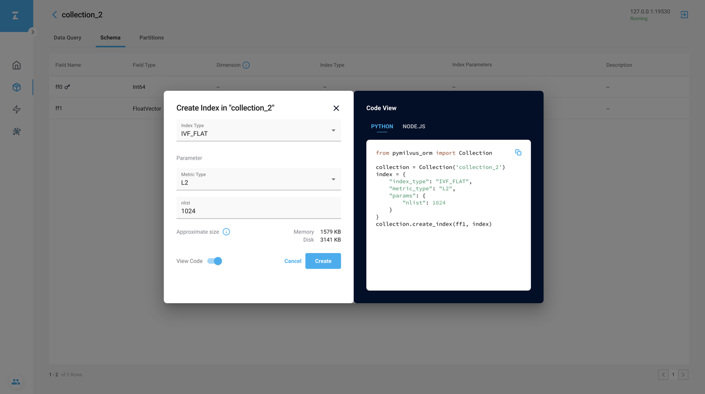
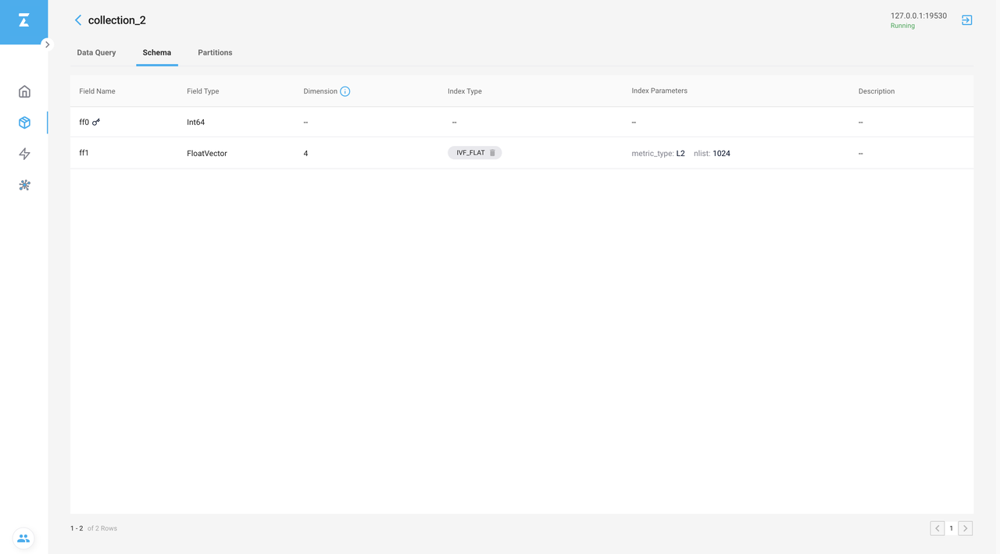
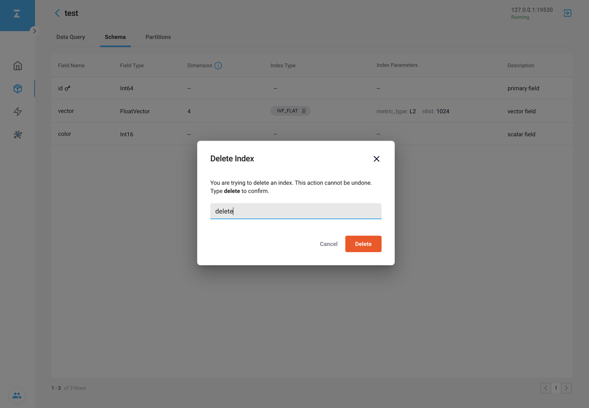

# Manage Index with Attu

This topic describes how to manage an index with Attu.

## Create indexes

This example builds an IVF_FLAT index with Euclidean distance as the similarity metrics and an `nlist` value of `1024`.

1. Click **Schema** on the **Collection** page. On the **Schema** tab page, click **CREATE INDEX** and the **Create Index** dialog box appears.

2. In the **Create Index** dialog box, select **IVF_FLAT** from the **Index Type** dropdown list, select **L2** from the **Metric Type** dropdown list, and enter `1024` in the `nlist` field.

3. (Optional) Turn on **View Code** and the **Code View** page appears. You can check the code in Python or Node.js as you want.

4. Click **Create** to create the index.

If successful, the type of the index you created appears in the **Index Type** column for the vector field.

## Delete indexes

1. Click the **Trash** icon in the **Index Type** column and the **Delete Index** dialog box appears.
2. Enter `delete` to confirm the deletion and click **Delete** to delete the indexes.

If successful, **CREATE INDEX** button appears in the Index Type column.

