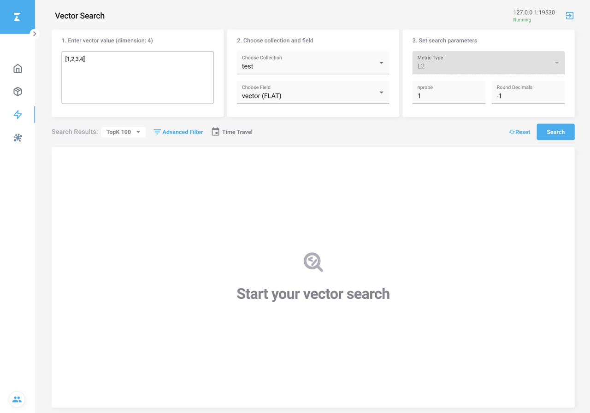
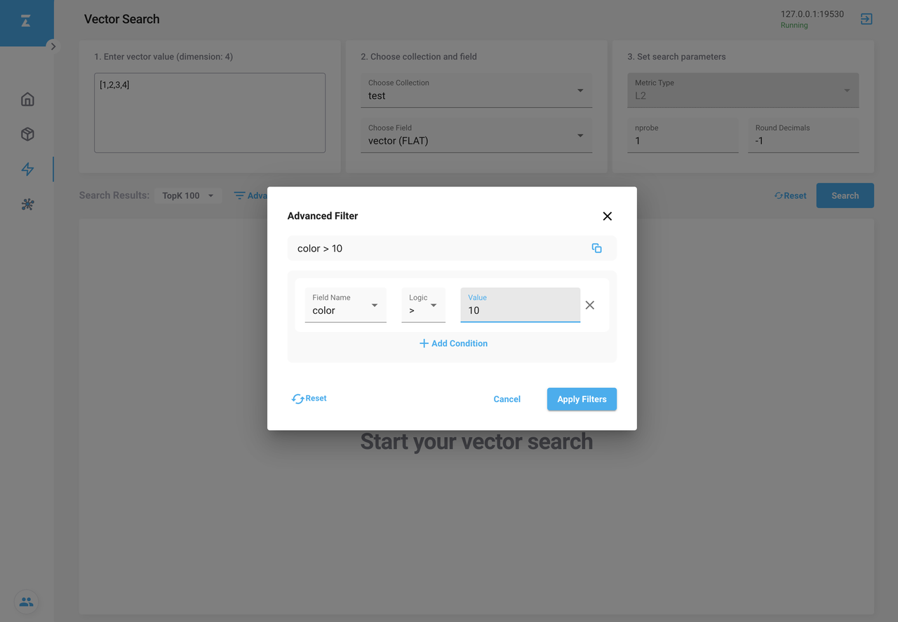
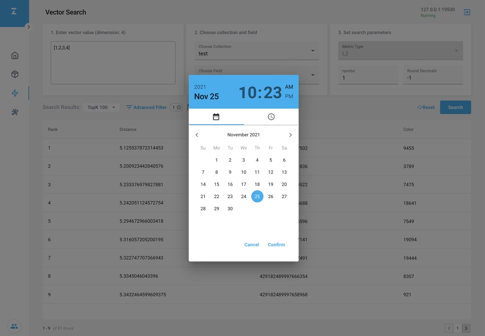
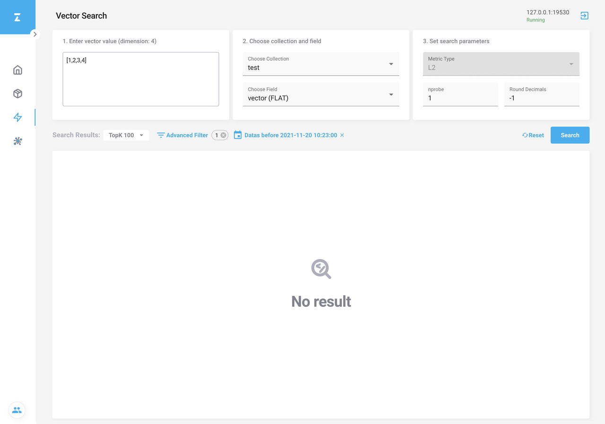

# Search Data with Attu

This topic describes how to search data with Attu.

## Conduct a vector similarity search

On the basis of the regular vector similarity search, you can perform hybrid search of search with Time Travel.

### Load the collection to memory

All CRUD operations within Milvus are executed in memory. Load the collection to memory before conducting a vector similarity search. See [Load a collection](attu_collection.md#Load-a-collection) for more instruction.

### Set search parameters

1. Select the collection and the vector field you wish to search in in the dropdown lists of the **Choose collection and field** section.
2. In the **Enter vector value** field, enter a vector (or vectors) with the same dimensions of the selected field as the target vector(s) to search with.
3. In the **Set search parameters** section, specify the specific parameter(s) to the index and other search-related parameters.

### Hybrid search with advanced filters (optional)

Click **Advanced Filter** and the **Advanced Filter** dialog box appears. You can use the **AND** or **OR** operators to combine multiple conditions into a compound condition. The filter expression updates automatically with any changes to the conditions. See [boolean expression rule](boolean.md) for more information.

### Search with Time Travel (optional)

Milvus maintains a timeline for all data insert and delete operations. It allows users to specify a timestamp in a search to retrieve a data view at a specified point in time.

1. Click **Time Travel**, and select a time point in the dialog box that appears.

2. Specify the number of search results to return in the **TopK** dropdown list.
3. Click **Search** to retrieve the nearest search results, which indicate the most similar vectors.

