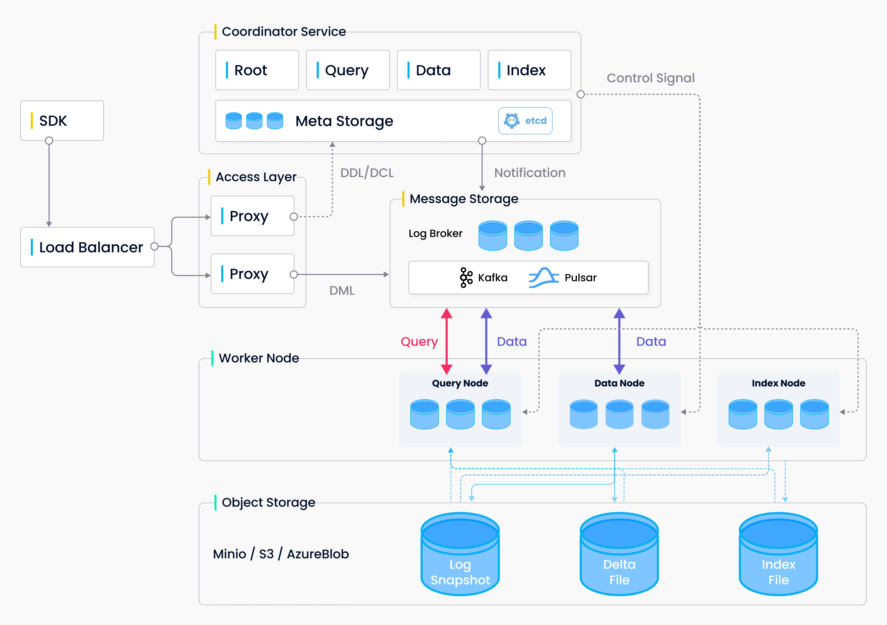

# 关于 Milvus

本文以问答的形式从几个维度来介绍 Milvus。通过阅读本文，你将了解 Milvus 是什么及其相关的基本原理、重要概念、核心优势、应用场景、周边工具等。此外，本文还简单介绍了 Milvus 的系统架构设计以及 Milvus 支持的索引和距离计算方式。

## 什么是 Milvus 向量数据库？

Milvus 于 2019 年开源，致力于存储、索引和管理由深度神经网络学习与其他机器学习模型生成的海量 Embedding 向量。

Milvus 向量数据库专为向量查询与检索设计，能够为万亿级向量数据建立索引。与现有的主要用作处理结构化数据的关系型数据库不同，Milvus 在底层设计上就是为了处理由各种非结构化数据转换而来的 Embedding 向量而生。

随着互联网不断发展，电子邮件、论文、物联网传感数据、社交媒体照片、蛋白质分子结构等非结构化数据已经变得越来越普遍。如果想要使用计算机来处理这些数据，需要使用 embedding 技术将这些数据转化为向量。随后，Milvus 会存储这些向量，并为其建立索引。Milvus 能够根据两个向量之间的距离来分析他们的相关性。如果两个向量十分相似，这说明向量所代表的源数据也十分相似。

## 重要概念

如果你刚刚接触向量数据库及向量相似度检索领域，可以通过阅读以下重要概念获得初步了解。

更多 Milvus 相关概念详见 [Milvus 术语表](glossary.md)。

### 非结构化数据

非结构化数据指的是数据结构不规则，没有统一的预定义数据模型，不方便用数据库二维逻辑表来表现的数据。非结构化数据包括图片、视频、音频、自然语言等，占所有数据总量的 80%。非结构化数据的处理可以通过各种人工智能（AI）或机器学习（ML）模型转化为向量数据进行。

### 特征向量

向量又称为 embedding vector，是指由 embedding 技术从离散变量（如图片、视频、音频、自然语言等等各种非结构化数据）转变而来的连续向量。在数学表示上，向量是一个由浮点数或者二值型数据组成的 n 维数组。通过现代的向量转化技术，比如各种人工智能（AI）或者机器学习（ML）模型，可以将非结构化数据抽象为 n 维特征向量空间的向量。这样就可以采用最近邻算法（ANN）计算非结构化数据之间的相似度。

### 向量相似度检索

相似度检索是指将目标对象与数据库中数据进行比对，并召回最相似的结果。同理，向量相似度检索返回的是最相似的向量数据。近似最近邻搜索（ANN）算法能够计算向量之间的距离，从而提升向量相似度检索的速度。如果两条向量十分相似，这就意味着他们所代表的源数据也十分相似。

## 为什么选择使用 Milvus？

- 高性能：性能高超，可对海量数据集进行向量相似度检索。
- 高可用、高可靠：Milvus 支持在云上扩展，其容灾能力能够保证服务高可用。
- 混合查询：Milvus 支持在向量相似度检索过程中进行标量字段过滤，实现混合查询。
- 开发者友好：支持多语言、多工具的 Milvus 生态系统。

## Milvus 支持哪些索引类型及距离计算公式？

创建索引是一个组织数据的过程，是向量数据库实现快速查询百万、十亿、甚至万亿级数据集所依赖的一个巨大组成部分。在查询或检索数据前，必须先指定索引类型及距离计算公式。**如未指定索引类型，Milvus 将默认执行暴搜。**

### 索引类型

Milvus 目前支持的向量索引类型大都属于 ANNS（Approximate Nearest Neighbors Search，近似最近邻搜索）。

- **FLAT**：适用于需要 100% 召回率且数据规模相对较小（百万级）的向量相似性搜索应用。
- **IVF_FLAT**：基于量化的索引，适用于追求查询准确性和查询速度之间理想平衡的场景。
- **IVF_SQ8**：基于量化的索引，适用于磁盘或内存、显存资源有限的场景。
- **IVF_PQ**：基于量化的索引，适用于追求高查询速度、低准确性的场景。
- **HNSW**：基于图的索引，适用于追求高查询效率的场景。
- **ANNOY**：基于树的索引，适用于追求高召回率的场景。 

更多内容详见[根据应用场景选择索引](index_selection.md)。

### 距离计算公式

Milvus 基于不同的距离计算方式比较向量间的距离。根据插入数据的形式，选择合适的距离计算方式能极大地提高数据分类和聚类性能。

浮点型向量主要使用以下距离计算公式：

- **欧氏距离 (L2)**：主要运用于计算机视觉领域。
- **内积 (IP)**: 主要运用于自然语言处理（NLP）领域。
二值型向量主要使用以下距离计算公式：
- **汉明距离 (Hamming)**：主要运用于自然语言处理（NLP）领域。
- **杰卡德距离 (Jaccard)**：主要运用于化学分子式检索领域。
- **谷本距离 (Tanimoto)**：主要运用于化学分子式检索领域。
- **超结构 (Superstructure)**：主要运用于检索化学分子式的相似超结构。
- **子结构 (Substructure)**：主要运用于检索化学分子式的相似子结构。

更多内容详见 [距离计算方式](metric.md#floating)。

## Milvus 应用场景

你可以使用 Milvus 搭建符合自己场景需求的向量相似度检索系统。Milvus 使用场景包括：

- [图片检索系统](image_similarity_search.md)：以图搜图，从海量数据库中即时返回与上传图片最相似的图片。
- [视频检索系统](video_similarity_search.md)：将视频关键帧转化为向量并插入 Milvus，便可检索相似视频，或进行实时视频推荐。
- [音频检索系统](audio_similarity_search.md)：快速检索海量演讲、音乐、音效等音频数据，并返回相似音频。
- [分子式检索系统](molecular_similarity_search.md)：超高速检索相似化学分子结构、超结构、子结构。
- [推荐系统](recommendation_system.md)：根据用户行为及需求推荐相关信息或商品。
- [智能问答机器人](question_answering_system.md)：交互式智能问答机器人可自动为用户答疑解惑。
- [DNA 序列分类系统](dna_sequence_classification.md)：通过对比相似 DNA 序列，仅需几毫秒便可精确对基因进行分类。
- [文本搜索引擎](text_search_engine.md)：帮助用户从文本数据库中通过关键词搜索所需信息。

更多应用场景详见 [Milvus 系统搭建教程](https://github.com/milvus-io/bootcamp/tree/master/solutions)及 [Milvus 用户](milvus_adopters.md)。

## Milvus 系统架构

Milvus 2.0 是一款云原生向量数据库，采用存储与计算分离的架构设计，所有组件均为无状态组件，极大地增强了系统弹性和灵活性。

整个系统分为四个层面：

- 接入层（Access Layer）：系统的门面，由一组无状态 proxy 组成。对外提供用户连接的 endpoint，负责验证客户端请求并合并返回结果。
- 协调服务（Coordinator Service）：系统的大脑，负责分配任务给执行节点。协调服务共有四种角色，分别为 root coord、data coord、query coord 和 index coord。
- 执行节点（Worker Node）：系统的四肢，负责完成协调服务下发的指令和 proxy 发起的数据操作语言（DML）命令。执行节点分为三种角色，分别为 data node、query node 和 index node。
- 存储服务 （Storage）： 系统的骨骼，负责 Milvus 数据的持久化，分为元数据存储（meta store）、消息存储（log broker）和对象存储（object storage）三个部分。

更多系统原理的相关内容详见 [系统架构](architecture_overview.md)。

## 开发者工具

Milvus 为 DevOps 提供丰富的 API 及工具。

### API 

Milvus 客户端库对 Milvus API 进行了封装。你可以使用 Milvus 客户端库通过应用代码进行数据插入、删除、查询等操作。

- [PyMilvus](https://github.com/milvus-io/pymilvus)
- [Node.js SDK](https://github.com/milvus-io/milvus-sdk-node)
- [Go SDK](https://github.com/milvus-io/milvus-sdk-go)

我们正在不断开发新的客户端库。如果你愿意为 Milvus 贡献代码，请前往相应的 [Milvus 项目](https://github.com/milvus-io) 仓库。

### Milvus 生态系统工具 

Milvus 生态系统提供多种强大的工具，包括：

- [Milvus CLI](https://github.com/milvus-io/milvus_cli#overview)
- [Attu](https://github.com/zilliztech/attu)：图形化管理系统。
- [MilvusDM](https://milvus.io/docs/v2.0.0/migrate_overview.md)：用于导入或导出 Milvus 数据
- [Milvus sizing tool](https://milvus.io/tools/sizing/)：用于根据向量数据量及索引类型估算所需的原始文件大小、内存大小及固态硬盘大小。

## 更多资源

- 3 分钟快速上手 Milvus：
  - [Hello Milvus](example_code.md)
- 在测试或生产环境中安装 Milvus：
  - [安装前提](prerequisite-docker.md)
  - [安装单机版 Milvus](install_standalone-docker.md)
  - [安装分布式版 Milvus](install_cluster-docker.md)
- 如果你想要深入了解 Milvus 系统架构设计：
  - 阅读 [Milvus 系统架构](architecture_overview.md)

