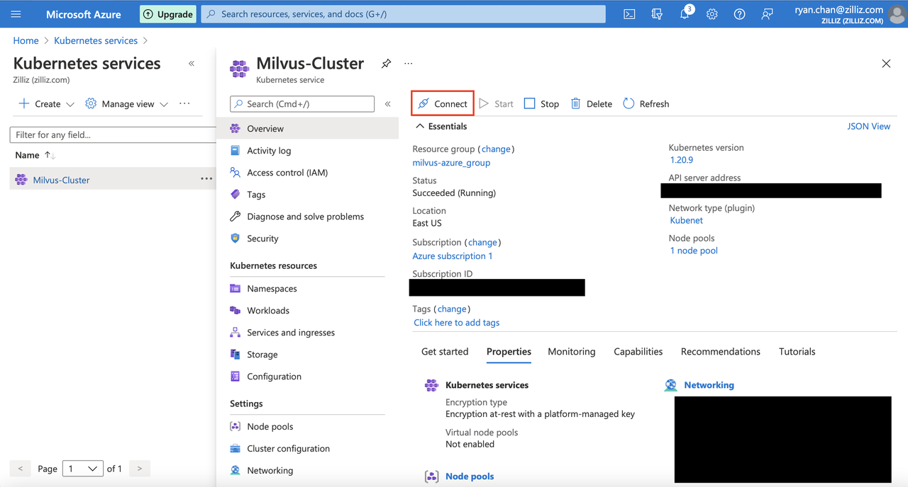
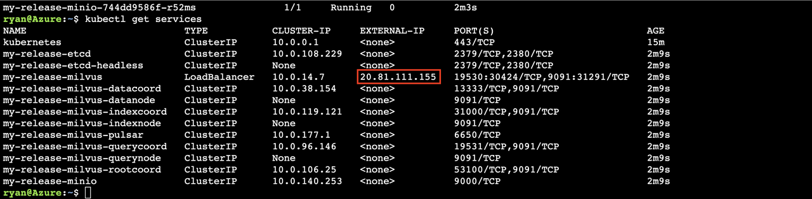

# 使用 Kubernetes 在 Microsoft Azure 上部署 Milvus 的指南

本指南是一套在 Microsoft Azure 上部署 Milvus 集群的说明

## 先决条件

1. 确认您的 Azure 项目设置正确，并且您有权访问要使用的资源。如果不确定自己的权限，请联系 Azure 管理员。

2. 安装 Azure CLI 并确认您已正确进行身份验证。

3. 安装 kubectl 和 helm。还可以从浏览器使用 Azure Cloud Shell，它提供了 Bash 或 PowerShell 选项。

<div class="alert note">
Azure Cloud Shell 预装了 Azure CLI、kubectl 和 helm。 
</div>

## 使用 Azure Kubernetes 服务 (AKS) 预配 Kubernetes 群集

本指南使用 [Azure 门户](https://docs.microsoft.com/en-us/azure/aks/kubernetes-walkthrough-portal) 创建集群和 AKS 以预配 Kubernetes 集群。可以访问AKS创建界面 [这里](https://portal.azure.com/#create/microsoft.aks).

1. 选择合适的选项.

**基本**

- **Project 细节**
  - `Subscription`: 请联系您组织的 Azure 管理员以确定您应该使用哪个订阅。

  - `Resource group`: 请联系您组织的 Azure 管理员以确定您应该使用哪个资源组。

- **Cluster 细节**
  - `Kubernetes cluster name`: 您自己选择的 cluster 名称。

  - `Region`: 您自己选择的地区。 

  - `Availability zones`: [选择多个可用区](https://docs.microsoft.com/en-us/azure/aks/availability-zones#overview-of-availability-zones-for-aks-clusters) 根据您的需求。对于生产集群，我们建议您使用多个可用区。但出于测试目的，没有必要使用多个可用区。

- **Primary Node Pool**

  - `Node size`: 我们强烈建议选择具有至少 **16 GiB 可用 RAM** 的节点类型。根据您的数据规模，您还可以选择具有更多资源的节点类型。

    <div class="alert note">    
    您可以选择不同的机器类型以更好地适应您的工作情况，但我们强烈建议工作节点都具有至少 16 GB 的内存，以确保最低限度的稳定运行。
    </div>

  - `Scale Method`: 您自己选择的 **scaling method**

  - `Node Count`: 您自己选择的nodes数量。

**Node Pools**

- `Enable Virtual Nodes`: 是否启用 virtual nodes 由您自己选择。

- `Enable Virtual Machine Scale Sets`: 我们建议选择 `enabled`.

**Networking**

- Network configuration: 我们建议选择 `Kubenet`.

- DNS name prefix: 您自己选择的 DNS name prefix.

- Traffic Routing

  - Load Balancer: `Standard`

  - HTTP application routing: `Not Needed`

2. 选择适当的选项后，查看并创建一个 cluster。在继续下一步之前，让 cluster 旋转几分钟。 

## 使用 Helm 部署 Milvus

设置 cluster 后，我们现在可以使用 Helm 部署 Milvus。

#### 在你开始之前

1. 将您的 shell 连接到新创建的 Kubernetes cluster。 
导航到 Azure 资源面板下的 Kubernetes cluster。通过选择“概览”选项卡下的“连接按钮”获取必要的连接信息。请参阅下面的屏幕截图。 



2. 使用 Azure Cloud Shell 或 Azure CLI 设置订阅并使用“connect”选项卡中的信息配置 cluster 凭据。

```
az account set --subscription EXAMPLE-SUBSCRIPTION-ID
```

```
az aks get-credentials --resource-group YOUR-RESOURCE-GROUP --name YOUR-CLUSTER-NAME
```

<div class="alert note">

对 helm 部署使用相同的 shell。如果您更改或关闭您的 shell，请在继续部署之前重复上述两个命令。

</div>

#### 部署

1. 添加 Milvus chart repository。

```
helm repo add milvus https://milvus-io.github.io/milvus-helm/
```

2. 更新您的 Milvus chart。

```
helm repo update
```

3. 运行 helm 部署 Milvus. 

<div class="alert note">
在本指南中，我们选择名称 <code>my-release</code>, 但您可以更改名称。
</div>

```
helm install my-release milvus/milvus --set cluster.enabled=true --set service.type=LoadBalancer
```

等待几分钟让 pods 启动. 执行 `kubectl get services` 检查服务。如果服务成功启动，您可以看到列出的一组服务。



<div class="alert note">

请注意，负载均衡器的 EXTERNAL-IP 列下列出的 IP 是连接 Milvus 的 IP。 Milvus 的默认端口是 19530。

</div>

## 用 Azure Blob Storage

#### 概述

Azure Blob 存储是 Microsoft Azure 的云存储产品之一，与竞争对手共享许多功能，例如 AWS 的 S3 存储。


Azure gateway node 是 MinIO 服务器的替代运行方法，从客户端的角度来看，其行为相同，但根据 Azure 连接 API 将所有连接转换并转发到 Azure Blob 存储。

#### 如何使用


在使用 Azure gate node 之前，您需要设置一些变量。大多数变量都设置为适当的默认设置，但您仍然需要更改一些变量。

**您必须设置的 Metadata**

- `minio.azuregateway.enabled`: 必须设置为`true`才能启用操作。

  -  默认为 `false`. 

- `minio.accessKey`: 要使用的 Azure storage account 的名称.

- `minio.secretKey`: Azure cloud storage 的访问密钥。

- `externalAzure.bucketName`: 
要使用的 Azure storage bucket 的名称。与 S3/MinIO buckets 不同，AzureB 必须全局 唯一。因此默认值是未设置的。

  - 默认未设置.

**Metadata 应该保留为默认值**

- `minio.azuregateway.replicas`: 
用于 Azure gateway 的 replica node 数。我们强烈建议只使用一个 replica node，因为 MinIO 对更高的数字没有很好的支持。 

  - 默认为 1.

- 您还应该继承所有正常的 MinIO metadata variables.

示例 helm 安装:

```
helm install my-release ./milvus --set cluster.enabled=true --set service.type=LoadBalancer --set minio.persistence.enabled=false --set externalAzure.bucketName=milvusbuckettwo --set minio.azuregateway.enabled=true --set minio.azuregateway.replicas=1 --set minio.accessKey=milvusstorage --set minio.secretKey=your-azure-key
```

