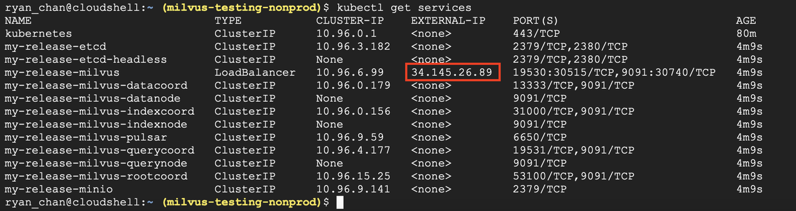

# 使用 Kubernetes 在 GCP 上部署 Milvus 集群

这张说明书将介绍如何在 Google Cloud Platform (GCP) 上部署 Milvus 集群.

## 在开始之前

在开始之前, 确认你想用的 GCP 项目. 如果你还没决定用哪个项目, 联系你的 GCP 管理员然后请他帮你 [设置一个](https://cloud.google.com/resource-manager/docs/creating-managing-projects). **"milvus-testing-nonprod"** 是项目的名字， 在这张说明书，我们将用这个项目. 如果你的项目的名字不同, 你要随着点窜命令.

接着, [安装 GCP SDK](https://cloud.google.com/sdk/docs/quickstart#installing_the_latest_version) 及确认你已经认证. 安装 [kubectl](http://gcloud%20container%20clusters%20get-credentials%20hello-cluster/) 及 [helm](http://gcloud%20container%20clusters%20get-credentials%20hello-cluster/). 或者, 你可以在你的浏览器使用 [Google Cloud Shell](https://cloud.google.com/shell), 它有 GCP SDK, kubectl, 及 helm 预装.

## 设置网络

如果你有一个已存在的 virtual private cloud (VPC) 网络然后你想用它, 你可以马上进行 [创建 Milvus 防火墙规则](gcp.md#Create-a-Firewall-Rule-for-Milvus).

如果你没有一个已存在的 VPC 网络或者你想新建一个, 先建新一个 VPC 网络，然后开始创建 Milvus 防火墙规则.

### 创建一个新 VPC 网络

打开你的 CLI 然后及建一个新 VPC.

<div class="alert note">
用你项目的名字来替换<b>milvus-testing-nonprod</b>.
</div>

```Apache
gcloud compute networks create milvus-network --project=milvus-testing-nonprod --subnet-mode=auto --mtu=1460 --bgp-routing-mode=regional
```

接着, 建一防火墙规则的基本系统，允许内部沟通, ssh 连接, icmp, 及 rdp 等流量.

```Apache
gcloud compute firewall-rules create milvus-network-allow-icmp --project=milvus-testing-nonprod --network=projects/milvus-testing-nonprod/global/networks/milvus-network --description=Allows\ ICMP\ connections\ from\ any\ source\ to\ any\ instance\ on\ the\ network. --direction=INGRESS --priority=65534 --source-ranges=0.0.0.0/0 --action=ALLOW --rules=icmp

gcloud compute firewall-rules create milvus-network-allow-internal --project=milvus-testing-nonprod --network=projects/milvus-testing-nonprod/global/networks/milvus-network --description=Allows\ connections\ from\ any\ source\ in\ the\ network\ IP\ range\ to\ any\ instance\ on\ the\ network\ using\ all\ protocols. --direction=INGRESS --priority=65534 --source-ranges=10.128.0.0/9 --action=ALLOW --rules=all

gcloud compute firewall-rules create milvus-network-allow-rdp --project=milvus-testing-nonprod --network=projects/milvus-testing-nonprod/global/networks/milvus-network --description=Allows\ RDP\ connections\ from\ any\ source\ to\ any\ instance\ on\ the\ network\ using\ port\ 3389. --direction=INGRESS --priority=65534 --source-ranges=0.0.0.0/0 --action=ALLOW --rules=tcp:3389

gcloud compute firewall-rules create milvus-network-allow-ssh --project=milvus-testing-nonprod --network=projects/milvus-testing-nonprod/global/networks/milvus-network --description=Allows\ TCP\ connections\ from\ any\ source\ to\ any\ instance\ on\ the\ network\ using\ port\ 22. --direction=INGRESS --priority=65534 --source-ranges=0.0.0.0/0 --action=ALLOW --rules=tcp:22
```

### 创建一个 Milvus 防火墙规则

建一个允许外部入口端口 19530 的防火墙规则, 它是端口 Milvus 使用的一个.

```Apache
gcloud compute --project=milvus-testing-nonprod firewall-rules create allow-milvus-in --description="Allow ingress traffic for Milvus on port 19530" --direction=INGRESS --priority=1000 --network=projects/milvus-testing-nonprod/global/networks/milvus-network --action=ALLOW --rules=tcp:19530 --source-ranges=0.0.0.0/0
```

## 使用 GKE 规定一个 Kubernetes 集群

我们用 GKE 标准规定一个 Kubernetes 集群. 在这本说明书, 我们建一个有两个节点的集群, 在`us-west1-a` zone , 用于`e2-standard-4` 机器类型, 运行 image-type `COS_CONTAINERD`.

<div class="alert note">
你可以改变上述选项适合你集群的需要.
</div>

### 机器类型选择

在这本说明书, 我们的机器类型是 `e2-standard-4`, 它有 4 vCPU 及 16GB 的内存, 用来进行工作节点.

<div class="alert note">
你可以用不同的机器类型以更好地贴近你的要求, 但我们强烈建议为了确保最小稳定运行， 所有工作节点有至少有16GB的内存.
</div>

```Apache
gcloud beta container --project "milvus-testing-nonprod" clusters create "milvus-cluster-1" --zone "us-west1-a" --no-enable-basic-auth --cluster-version "1.20.8-gke.900" --release-channel "regular" --machine-type "e2-standard-4" --image-type "COS_CONTAINERD" --disk-type "pd-standard" --disk-size "100" --max-pods-per-node "110" --num-nodes "2" --enable-stackdriver-kubernetes --enable-ip-alias --network "projects/milvus-testing-nonprod/global/networks/milvus-network" --subnetwork "projects/milvus-testing-nonprod/regions/us-west1/subnetworks/milvus-network"
```

你的集群可能需要几分钟才旋转. 创建你的集群后, 获取集群的验证凭据.

```Apache
gcloud container clusters get-credentials milvus-cluster-1
```

这配置 **kubectl** 为了使用集群.

## 使用 Helm 部署 Milvus

设置集群后, 我们现在可以部署 Milvus. 如果在上一步中你用了不同的外壳, 再次获取凭据.

```Apache
gcloud container clusters get-credentials milvus-cluster-1
```

1. 添加 Milvus chart 仓库.

```Apache
helm repo add milvus https://milvus-io.github.io/milvus-helm/
```

2. 更新你的 Milvus chart.

```Apache
helm repo update
```

3. 运行 helm 然后部署 Milvus.

<div class="alert note">
在本说明书, 我们 选择<code>my-release</code>的名字, 但你可以改变这个名字.
</div>

```Thrift
helm install my-release milvus/milvus --set cluster.enabled=true --set service.type=LoadBalancer
```

Pods 启动时需要几分钟时间 , 运行 <code>kubectl get services</code> 以检查服务. 如果服务被成功启动, 你可以看已列出的一组服务.



<div class="alert note">
注意列<code>EXTERNAL-IP</code>列的 IP 为负载平衡器. 这是用来连接到Milvus的 IP.
</div>

## 使用 Google Cloud Storage

### 概观

Google Cloud Storage (GCS) 是 Google Cloud Platform equivalent of AWS's S3 storage.
The GCS gateway node is an alternative running method for the MinIO 服务器 which behaves the same from the client's perspective, 但 translates and forwards all connections to GCS with the according GCS connection API.

### 如何用

用 GCS 网关节点时需要设定了若干变量. 某些变量已经设置为合适的默认, 但其它需要被使用者涂改.

#### Secrets

MinIO GCS 网关节点需要一组有效的 GCP 服务帐户凭据以便连接 GCS. 这些凭据需要存放及被分发在 Kubernetes secret. Kubernetes secret 需要包含三类型的数据:

- `accesskey`: MinIO access key; string literal.
- `secretkey`: MinIO secret key; string literal.
- `gcs_key.json`: GCP 服务帐户凭据; json file.

Secret 创造的例子:

```shell
$ kubectl create secret generic mysecret --from-literal=accesskey=minioadmin --from-literal=secretkey=minioadmin --from-file=gcs_key.json=/home/credentials.json
```

<div class="alert note">
如果你选者 <code>accesskey</code> 及 <code>secretkey</code>值除了默认 <code>minioadmin/minioadmin</code>, 你也要更新 <code>minio.accessKey</code> 及 <code>minio.secretKey</code> 元数据变量.
</div>

#### 元数据

**元数据需要被使用者设定:**

- `minio.gcsgateway.enabled`: 需要设定为 "true" 才能启用操作.
  - 默认是 false.
- `minio.gcsgateway.projectId`: 与服务帐户及 bucket 对应 的 GCP 项目 ID.
  - 默认是 unset.
- `minio.existingSecret`: 以前定义 secret 的名称.
  - 默认是 unset
- `externalGcs.bucketName`: 使用 GCS 存储 bucket 的名称. 不同 S3/MinIO buckets, GCS buckets 需要 **全球**的独特. 因此默认值是 unset.
  - 默认是 unset.

**元数据应该保留默认:**

- `minio.gcsgateway.replicas`: 用于 GCS 网关的备份数量 . 我们强烈建议只用一个因为 MinIO 对更大的数字没有很好的支持.
  - 默认是 1.
- `minio.gcsgateway.gcsKeyJson`: GCS 帐户服务的访问凭证文件的路径. 你不应该改变默认值.
  - 默认是 `/etc/credentials/gcs_key.json`.
- 你也应该继承所有正常的 MinIO 元数据变量.

安装 helm 的例子:

```shell
$ helm install my-release milvus/milvus --set cluster.enabled=true --set minio.existingSecret=mysecret --set minio.gcsgateway.enabled=true --set minio.gcsgateway.projectId=milvus-testing-nonprod --set externalGcs.bucketName=milvus-bucket-example
```
