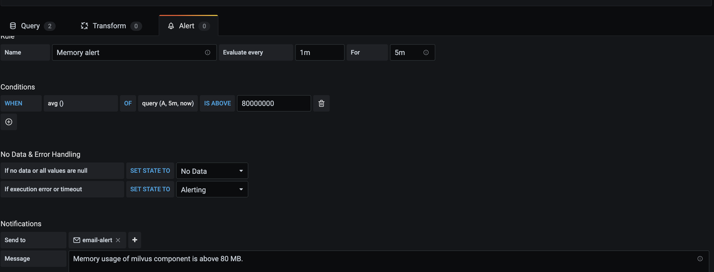

# 监控

## Prometheus 端点

Prometheus 是一款开源的 Kubernetes 监控工具。你可以使用 Prometheus 从端点拉取数据，并在 *http://<component-host>:9091/metrics* 暴露出每个 Milvus 2.0 集群组件的监控指标。

## Prometheus Operator
[Prometheus Operator](https://github.com/prometheus-operator/prometheus-operator) 以扩展 Kubernetes API 的形式实现自动化的方式高效管理 Prometheus 监控实例。使用 Prometheus Operator 后，你无需手动添加目标指标和服务器。

Prometheus Operator 架构
ServiceMonitor 的自定义资源（CRD）支持声明式定义动态服务的监控方式以及通过配置标签选择需要监控的服务。你可以使用 Prometheus Operator 设置监控指标暴露规则。系统将根据设置的规则自动发现新服务，你无需再手动重新设定配置。


## Kube-prometheus

[Kube-prometheus](https://github.com/prometheus-operator/kube-prometheus) 集合了 Kubernetes 清单文件、[Grafana](http://grafana.com/) 可视化面板以及 [Prometheus 记录规则](https://prometheus.io/docs/prometheus/latest/configuration/recording_rules/)。Kube-prometheus 还提供详细的文档及脚本帮助用户使用 Prometheus Operator 轻松监控 Kubernetes 集群。

**使用清单目录中的配置创建监控堆栈**
```shell
git clone https://github.com/prometheus-operator/kube-prometheus.git
kubectl create -f manifests/setupuntil kubectl get servicemonitors --all-namespaces ; do date; sleep 1; echo ""; done
kubectl create -f manifests/
```

**删除监控堆栈**
```
kubectl delete --ignore-not-found=true -f manifests/ -f manifests/setup
```

**访问 Prometheus 及 Grafana**
```Shell
kubectl --namespace monitoring port-forward svc/prometheus-k8s 9090
kubectl --namespace monitoring port-forward svc/grafana 3000
```

可通过 http://localhost:9090 访问 Prometheus，通过 http://localhost:3000 访问 Grafana。你还可以通过默认的 Grafana 账户用户名:密码 `admin:admin` 访问 Grafana。

## 使用 Milvus Helm Chart 启用 ServiceMonitor

默认情况下，需要使用 Milvus Helm Chart 手动启用 ServiceMonitor。在 Kubernetes 集群中安装 Prometheus Operator 后可通过添加参数 `metrics.serviceMontior.enabled=true` 来启用 ServiceMonitor。

```
helm install my-release milvus/milvus --set cluster.enabled=true --set metrics.serviceMonitor.enabled=true
```

Helm 安装完成后，使用 `kubectl` 检查 ServiceMonitor 资源。
```Shell
kubectl get servicemonitor
NAME                           AGE
my-release-milvus              54s
```

## 使用 Grafana 展示监控指标
除了使用 Prometheus 以图形化的方式展示监控指标以外，还可以使用可视化工具 Grafana。Grafana 能够轻松对接 Prometheus。

**下载并导入 Milvus-dashboard.json**
```Shell
wget https://raw.githubusercontent.com/milvus-io/milvus/master/deployments/monitor/grafana/milvus-dashboard.json
```


**选择 Milvus 实例**


下图为 Milvus 组件面板界面。


### 在 Grafana 中添加报警

如需为 Milvus 组件内存使用情况添加报警，先编辑 `Memory` 面板，新增查询请求并使用指标`process_resident_memory_bytes{app_kubernetes_io_name="milvus", app_kubernetes_io_instance=~"my-release", namespace="default"}`:



保存可视化面板设置，报警界面将在几分钟后出现。


<div class="alert note">

1. Grafana 报警查询请求不支持使用模版变量。因此，在新增第二个请求并重命名为 `A` 时，标签中不应该包含任何模版变量。


2. 添加 `notification channel`，并在 `Send to` 一栏中标明相应通知渠道，以接收报警消息。

</div>