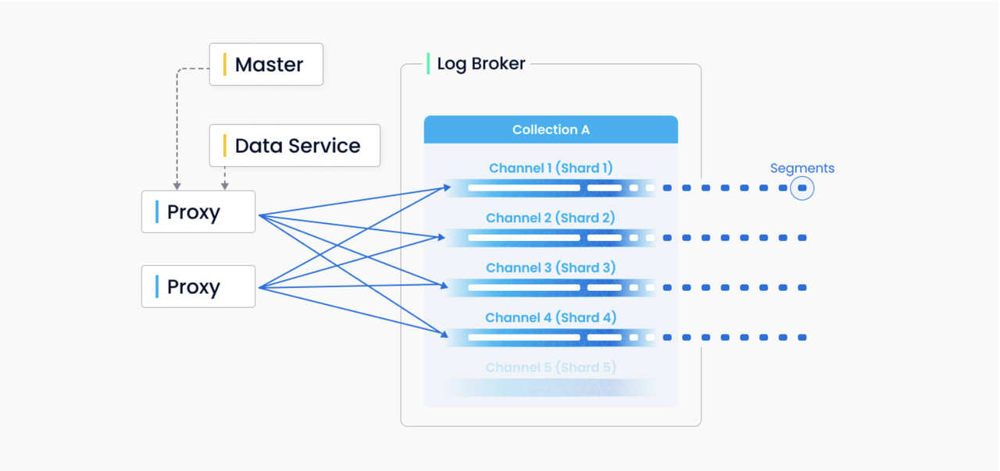
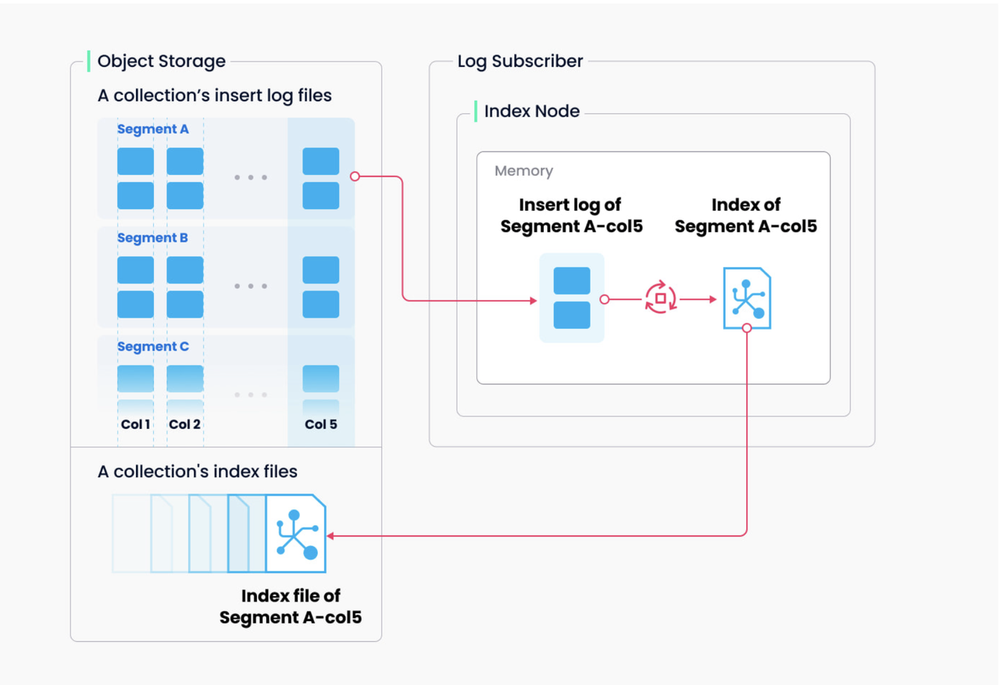
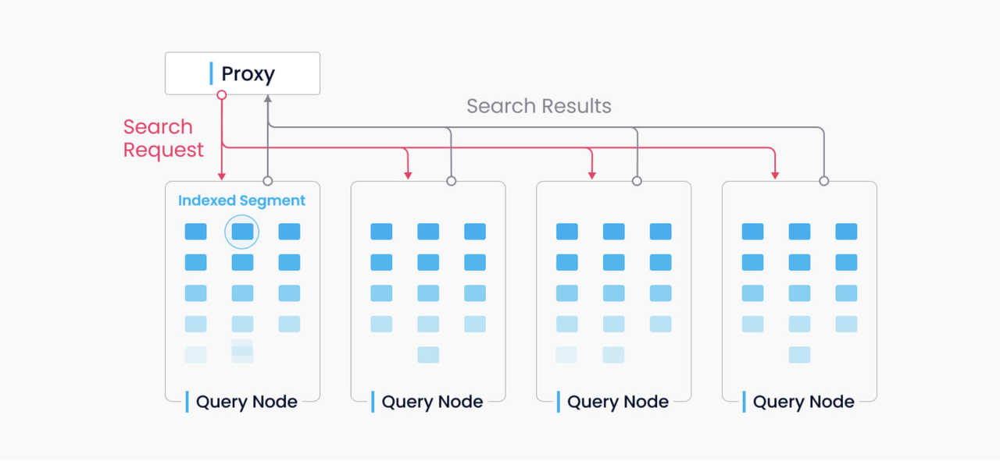

# Milvus 系统架构

Milvus 基于 FAISS、Annoy、HNSW 等向量搜索库构建，核心是解决稠密向量相似度检索的问题。在向量检索库的基础上，Milvus 支持了数据分区分片、持久化、增量数据摄取、标量向量混合查询、Time Travel 等功能，同时大幅优化了向量检索的性能。我们推荐用户使用 Kubernetes 部署 Milvus，以获得最佳的可用性和弹性。

## 架构设计

Milvus 采用 shared-disk 架构，存储计算完全分离，计算节点支持横向扩展。

### 整体架构

遵循数据流和控制流分离的原则，Milvus 整体分为了四个层次，分别为接入层（access layer）、协调服务（coordinator service）、执行层（worker node）和存储层（storage）。各个层次相互独立，独立扩展和容灾。

#### 接入层

接入层对外暴露了客户端连接的 endpoint，负责处理客户端链接，进行用户请求的静态验证和基本的动态检查，完成向其他系统组件内组合调用获取操作结果并向客户端返回。Proxy 本身是无状态的，一般通过负载均衡组件（Nginx、Kubernetes Ingress、NodePort、LVS）对外提供统一的访问地址并提供服务。Milvus 是典型的大规模并行处理（MPP）架构，proxy 也会负责从执行节点返回的结果，进行全局聚合和后处理后返回。

#### 协调服务

协调服务是系统的大脑，负责了集群拓扑节点管理、负载均衡、时间戳生成、数据声明和数据管理等功能，通过依赖元数据存储实现元信息持久化和故障切换。协调服务共计四种角色：

- **Root coordinator (root coord)** 负责处理 DDL、DCL 请求，比如创建删除 collection、partition、index等，同时负责维护中心授时服务 TSO 和时间窗口的推进。
- **Query coordinator (query coord)** 负责管理 query node 的拓扑结构、query node 之间数据段的负载均衡以及 growing segment 到 sealed segment的切换流程（handoff）。
- **Data coordinator (data coord)** 负责管理 data node 的拓扑结构，维护数据的元信息，触发 segment 的 flush、compaction等后台数据操作。
- **Index coordinator (index coord)** 负责管理 index node 的拓扑结构，管理索引构建任务，维护索引元信息。

#### 执行节点

执行节点是系统的四肢，负责完成协调服务下发的指令和 proxy 发起的 DML 命令。由于采取了存储计算分离，执行节点是无状态的，可以配合 Kubernetes 快速实现扩缩容和故障恢复。Worker node分为三种角色：
- **Query node** 通过订阅消息存储获取增量日志数据，基于对象存储获取历史数据，提供标量+向量的混合查询和搜索功能。
- **Data node** 通过订阅消息存储获取增量日志数据，处理写入、删除等请求，并将日志数据打包存储在对象存储上实现日志快照持久化。
- **Index node** 负责执行索引构建任务。Index node不需要常驻于内存，可以通过 serverless 的模式实现。

#### 存储服务

存储服务是系统的骨骼，负责 Milvus 数据的持久化，分为元数据存储（meta store）、消息存储（log broker）和对象存储（object storage）三个部分。

- **元数据存储：** 负责存储元信息的快照，比如 collection schema 信息、节点状态信息、消息消费的 checkpoint 等。元信息存储需要极高的可用性、强一致和事务支持，因此 etcd 是这个场景下的不二选择。除此之外，etcd 还承担了服务注册和健康检查的职责。
- **消息存储：** 一套支持回放的发布订阅系统，用于持久化流式写入的数据，以及可靠的异步执行查询，事件通知和结果返回。执行节点宕机恢复时，通过回放消息存储保证增量数据的完整性。目前分布式 Milvus 依赖 Pulsar 作为消息存储，Milvus standalone 依赖 RocksDB 作为消息存储。消息存储也可以替换为 Kafka、Pravega 等流式存储。
- **对象存储：** 负责存储日志的快照文件、标量/向量索引文件以及查询的中间处理结果。AWS S3 和Azure Blob已经成为最广泛使用的低成本存储，具备云原生弹性、按需计费的优点。我们也支持MinIO，一个开源的轻量级对象存储服务。由于对象存储访问延迟较高，且需要按照查询计费，因此 Milvus 未来将会支持基于内存/SSD 的缓存池，通过冷热分离的方式提升性能降低成本。

### 主要组件

Milvus 支持两种部署模式，单机模式（standalone）和分布式模式（cluster）。两种模式具备完全相同的能力，用户可以根据数据规模、访问量等因素选择适合自己的模式。Standalone 模式部署的 Milvus 暂时不支持在线升级为 cluster 模式。

**单机版 Milvus** 包括三个组件：
- Milvus 负责提供系统的核心功能。
- Etcd 是元数据引擎，用于管理 Milvus 内部组件的元数据访问和存储，例如 proxy node、index node 等。 
- MinIO 是存储引擎，负责维护 Milvus 内部组件的数据持久化，例如 proxy node、index node 等。

**分布式版 Milvus** 由八个微服务组件和三个第三方底层服务组件组成，每个微服务组件可使用 Kubernetes 独立部署。

**微服务组件：**
- Root coord
- Proxy 
- Query coord 
- Query node 
- Index coord 
- Index node 
- Data coord 
- Data node

**第三方底层服务组件：**

- Etcd 负责存储集群中各组件的元数据信息。
- MinIO 负责处理集群中大型文件的数据持久化，如索引文件和全二进制日志文件。
- Pulsar 负责管理近期 collection 更新操作的日志，并提供流式日志输出和日志订阅服务。

### 日志系统

整个 Milvus 围绕日志为核心来设计，遵循日志即数据的准则，因此在 2.0 版本中没有维护物理上的表，而是通过日志持久化和日志快照来保证数据的可靠性。

日志系统作为系统的主干，承担了数据持久化和解耦的作用。通过日志的发布—订阅机制，Milvus 将系统的读、写组件解耦。一个极致简化的模型如上图所示，整个系统主要由两个角⾊构成，分别是“日志序列”与“⽇志订阅者”。其中的“⽇志序列”记录了所有改变库表状态的操作。“日志订阅者”通过订阅日志序列更新本地数据，以只读副本的⽅式提供服务。 发布—订阅机制的出现也给系统预留了很大的拓展空间，便于 change data capture（CDC）、全球部署等功能的拓展。 

## 关键路径

#### 数据写⼊

用户可以为每个 collection 指定 shard 数量，每个 shard 对应一个虚拟通道 vchannel。在 Milvus2.0 中，shard 是数据的粗粒度划分，每个 shard 进⼀步细分为若⼲个 segments。如下图所示，在 log broker 内，每个 vchanel 被分配了一个对应的物理通道 pchannel，用于处理各类⽇志序列的发布—订阅，当前版本中 vchannel 和 pchannel 是一一对应的。增删请求进入哪个 shard 由 proxy 决定，目前是基于主键哈希来决定的。

由于没有复杂事务，增删请求的检查与确认⼯作被提前至 proxy。每个 proxy 拥有⼀个库表元信息缓存，用于本地的动态检查。对于所有的增删请求，proxy 会先通过请求位于 root coord 的 TSO 中心授时模块获取时间戳，这个时间戳决定了数据最终可见和相互覆盖的顺序。Proxy 通过批量的方式从data coord 获取数据的所处的 segment 和 rowID，批量有助于提升系统的吞吐，降低中心节点的压力。

除增删类操作之外，数据定义类操作也会写⼊⽇志序列。由于数据定义类操作出现的频率很低，系统只为其分配⼀路 channel。 

Vchannel 由消息存储底层引擎的物理节点承担。每个 channel 在物理上不再进⼀步拆分，因此单个 vchannel 不会跨多个物理节点，不同 vchannel 可以被调度到不同的物理节点。 当 collection 写入出现瓶颈时，通常需要关注两个问题：一是 log broker 节点负载是否过高，需要扩容，二是 shard 是否足够多，保证每个 log broker 的负载足够均衡。

上图总结了⽇志序列的写⼊过程。负载主要由 proxy、log broker、data node、object storage 承担。 整体共四部分⼯作:请求的检查与发送、日志序列的发布—订阅、流式⽇志到日志快照的转换、日志快照的持久化存储。在 Milvus 2.0 中，对这四部分⼯作进行了解耦，做到同类型节点之间的对等。面向不同的⼊库负载，特别是大规模⾼波动的流式负载，各环节的系统组件可以做到独⽴的弹性伸缩。 

#### 索引构建

构建索引的任务由 index node 执⾏。为了避免数据更新导致的索引频繁重复构建，Milvus 将 collection 分成了更⼩的粒度，即 segment，每个 segment 对应自己的独⽴的索引。 

Milvus 可以对每个向量列、标量列和主键列构建索引。索引构建任务的输⼊与输出都是对象存储。Index node 拉取 segment 中需要构建索引的日志快照，在内存中进⾏数据与元信息的反序列化，并进⾏索引构建。构建完成后，将索引结构序列化并写回对象存储。 

对向量构建索引的过程属于计算密集、访存密集的负载类型，主要操作是向量运算与矩阵运算。由于被索引的数据维度过高，难以通过传统的树形结构进⾏高效索引。目前较为成熟的技术是基于聚类或图来表示⾼维稠密向量的近邻关系。无论哪种索引类型，都涉及到大规模向量数据的多次迭代计算，如寻找聚类、图遍历的收敛状态。

与传统的索引操作相比，向量计算能够充分利⽤ SIMD 加速。⽬前，Milvus 内置的引擎⽀持 SSE、AVX2、AVX512 等 SIMD 指令，并支持 GPU 加速。向量索引任务具备突发性、高资源消耗等特点，其弹性能力对于成本格外重要。未来 Milvus 会继续探索异构计算和 serverless，持续优化索引构建的成本。

同时，Milvus 支持标量过滤和主键查询功能。为了实现高效率的标量查询，Milvus 构建了 Bloom filter index、hash index、tree index 和 inverted index。未来 Milvus 会逐渐完善索引类型，提供bitmap index、rough index 等更多外部索引能力。

#### 数据查询

向量的索引本质上是倒排索引。在查询请求中指定⼀个向量 *Q* 与⽬标 collection A，目标是在 A 中找出与 *Q* 最邻近的 *k* 个向量，或者满足距离范围的全部向量，以及对应的 ID 和标量列。 

Collection A 中的数据被分为多个 segment，query node 以 segment 为粒度加载索引。查询请求会广播到全部的 query node，所有 query node 并发执行查询。在每个 query node内部，依次对本地的 segment 进行剪枝并搜索符合条件的数据，同时将各 segment 结果进行本地聚合返回。

上述过程中 query node 并不感知其他 query node 的存在，每个 query node 只需要完成两件任务：首先是响应 query coord 的调度，加载/卸载 segment；其次是根据本地的 segment 响应查询请求。Proxy 负责将每个 query node 返回的数据进行全局聚合返回给客户端。

Segment 存在两种状态——growing 和 sealed——分别对应增量数据和历史数据。对于 growing segment，query node 通过订阅 vchannel 获取数据的近期更新，当 growing segment 数据量增多到固定阈值时，会由 data coord 发起 seal 操作。Sealed segment 会进行索引构建，之后触发 query coord的 handoff 操作，将增量数据转换为历史数据。对于 sealed segment，query coord 会会综合考虑内存使用、CPU 开销、segment 数目等因素，尽可能均匀分配给所有的 query node。

