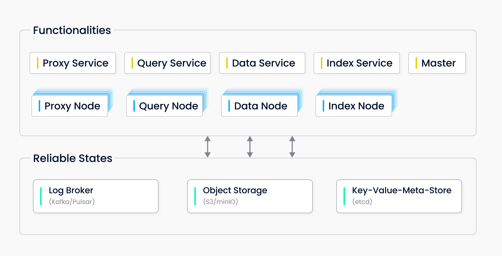

# Milvus 分布式版概述

Mivus 分布式中所有微服务可以独立部署在不同物理节点。

Milvus 微服务组件共有 9 个：

- Master

    负责处理定义类请求，如创建、删除 collection、 partition、索引等，同时负责维护 collection 的元数据。

- Proxy Service & Proxy Node

    负责处理客户端的连接，并将 Milvus 系统的 API 调用转换为系统内部组件的调用组合。对于客户端请求的静态检查和基本动态检查也在 Proxy 内完成。

- Query Service & Query Node

    负责处理查询类请求。其中 Query Node 以驻留内存的方式提供索引查询，Query Service 负责 Query Node 之间索引分片的均衡加载。

- Index Service & Index Node

    负责索引的构建。其中 Index Service 负责维护索引文件的元数据，Index Node 负责具体的索引构建任务。

- Data Service & Data Node

    负责处理数据操纵类请求，如 Insert、Delete entity等。其中 Data Service 负责维护数据的元数据，Data Node 主要负责日志的处理。

第三方基础服务组件 3 个:

- etcd

    负责系统中各类组件的元信息存储。

- MinIO

    负责系统内大文件的持久化存储，目前主要包括索引文件、全量的二进制日志。

- Pulsar

    负责维护近期的 Collection 更改操作日志，并提供日志的流式发布和订阅服务。