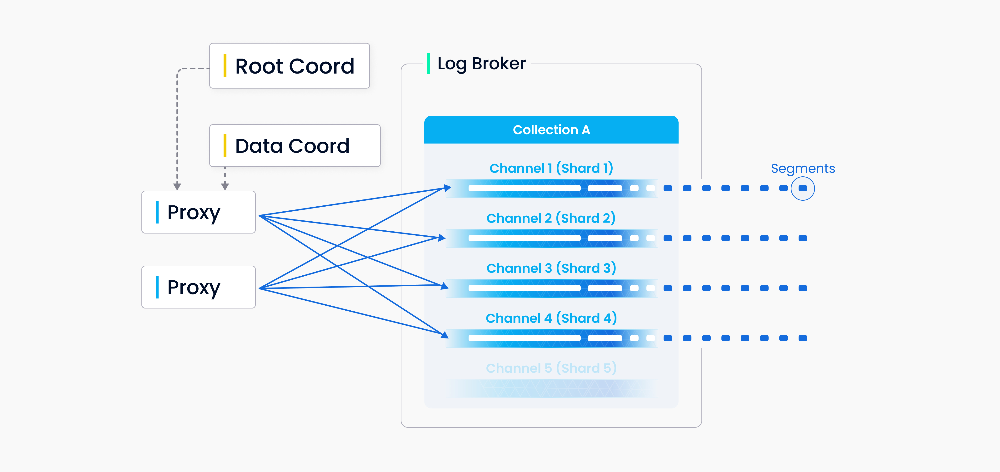
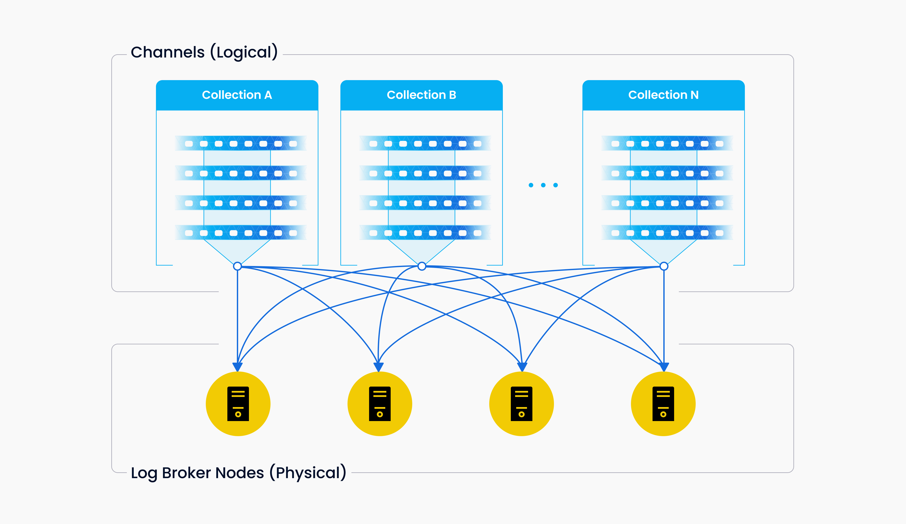
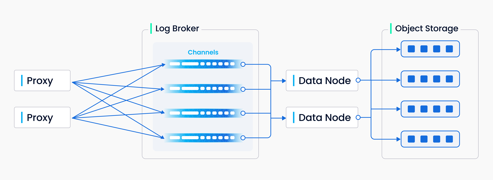
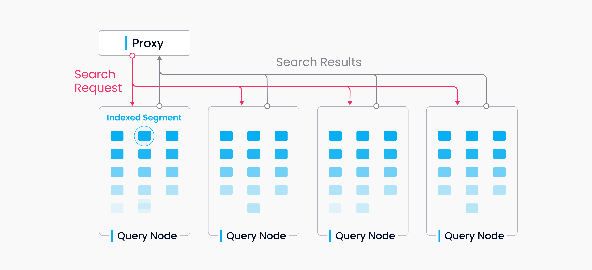
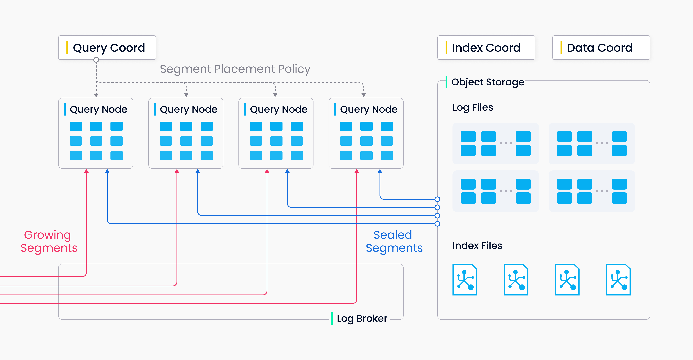

--- 
id: data_processing.md
--- 

# 关键路径

本文介绍了 Milvus 系统中数据写入、索引构建以及数据查询的具体实现。

## 数据写入

用户可以为每个 collection 指定 shard 数量，每个 shard 对应一个虚拟通道 *vchannel*。如下图所示，在 log broker 内，每个 *vchanel* 被分配了一个对应的物理通道 *pchannel*。Proxy 基于主键哈希决定输入的增删请求进入哪个 shard。

由于没有复杂事务，DML 的检查与确认⼯作被提前至 proxy。对于所有的增删请求，proxy 会先通过请求位于 root coord 的 TSO 中心授时模块获取时间戳。这个时间戳决定了数据最终可见和相互覆盖的顺序。除了分配时间戳，proxy 也为每行数据分配全局唯一的 rowID。RowID 以及 entity 所处的 segmentID 均从 data coord 批量获取，批量有助于提升系统的吞吐，降低 data coord 的负载。

除增删类操作之外，数据定义类操作也会写⼊⽇志序列。由于数据定义类操作出现的频率很低，系统只为其分配⼀路 channel。 

*Vchannel* 由消息存储底层引擎的物理节点承担。不同 *vchannel* 可以被调度到不同的物理节点，但每个 channel 在物理上不再进⼀步拆分，因此单个 *vchannel* 不会跨多个物理节点。 当 collection 写入出现瓶颈时，通常需要关注两个问题：一是 log broker 节点负载是否过高，需要扩容；二是 shard 是否足够多，保证每个 log broker 的负载足够均衡。

上图总结了⽇志序列的写⼊过程中涉及的四个组件：proxy、log broker、data node 和对象存储。 整体共四部分⼯作：DML 请求的检查与确认、日志序列的发布—订阅、流式⽇志到日志快照的转换、日志快照的持久化存储。在 Milvus 2.0 中，对这四部分⼯作进行了解耦，做到同类型节点之间的对等。面向不同的⼊库负载，特别是大规模⾼波动的流式负载，各环节的系统组件可以做到独⽴的弹性伸缩。

## 索引构建

构建索引的任务由 index node 执⾏。为了避免数据更新导致的索引频繁重复构建，Milvus 将 collection 分成了更⼩的粒度，即 segment，每个 segment 对应自己的独⽴的索引。 

Milvus 可以对每个向量列、标量列和主键列构建索引。索引构建任务的输⼊与输出都是对象存储。Index node 拉取 segment 中需要构建索引的日志快照，在内存中进⾏数据与元信息的反序列化，构建索引。索引构建完成后，将索引结构序列化并写回对象存储。 

对向量构建索引的过程属于计算密集、访存密集的负载类型，主要操作是向量运算与矩阵运算。由于被索引的数据维度过高，难以通过传统的树形结构进⾏高效索引。目前较为成熟的技术是基于聚类或图来表示⾼维稠密向量的近邻关系。无论哪种索引类型，都涉及到大规模向量数据的多次迭代计算，如寻找聚类、图遍历的收敛状态。

与传统的索引操作相比，向量计算需要充分利⽤ SIMD 加速。⽬前，Milvus 内置的引擎⽀持 SSE、AVX2、AVX512 等 SIMD 指令。向量索引任务具备突发性、高资源消耗等特点，其弹性能力对于成本格外重要。未来 Milvus 会继续探索异构计算和 serverless 架构，持续优化索引构建的成本。

同时，Milvus 支持标量过滤和主键查询功能。为了实现高效率的标量查询，Milvus 构建了 Bloom filter index、hash index、tree index 和 inverted index。未来 Milvus 会逐渐完善索引类型，提供bitmap index、rough index 等更多外部索引能力。

## 数据查询

数据查询指在一个指定 collection 中查找与目标向量最近邻的 *k* 个向量或满足距离范围的全部向量的过程。结果返回满足条件的向量及其对应的 ID 和列。

一个 collection 中的数据被分为多个 segment，query node 以 segment 为粒度加载索引。查询请求会广播到全部的 query node，所有 query node 并发执行查询。每个 query node 各自对本地的 segment 进行剪枝并搜索符合条件的数据，同时将各 segment 结果进行聚合返回。

上述过程中 query node 并不感知其他 query node 的存在，每个 query node 只需要完成两件任务：首先是响应 query coord 的调度，加载/卸载 segment；其次是根据本地的 segment 响应查询请求。Proxy 负责将每个 query node 返回的数据进行全局聚合返回给客户端。

Query node 中的 segment 只存在两种状态——growing 和 sealed——分别对应增量数据和历史数据。对于 growing segment，query node 通过订阅 *vchannel* 获取数据的近期更新。当 data coord 已经 flush 完该 segment 的所有数据，会通知 query coord 进行 handoff 操作，将增量数据转换为历史数据。Sealed segment 的索引由 index node 构建完成后会被 query node 自动加载。对于 sealed segment，query coord 会综合考虑内存使用、CPU 开销、segment 数目等因素，尽可能均匀分配给所有的 query node。
