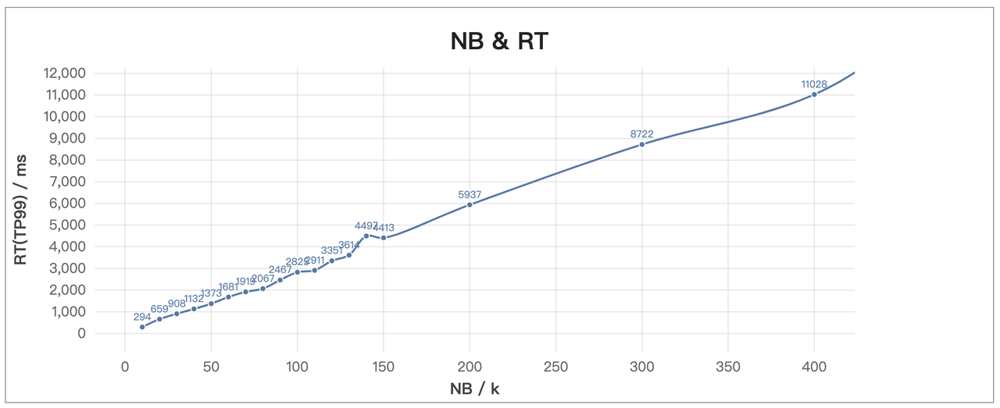
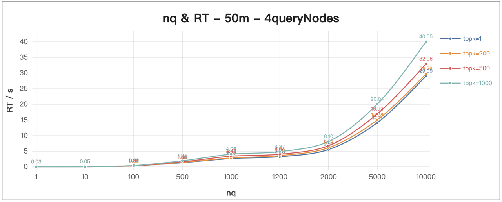
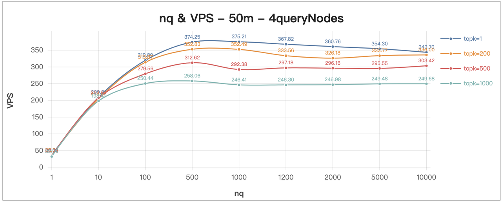
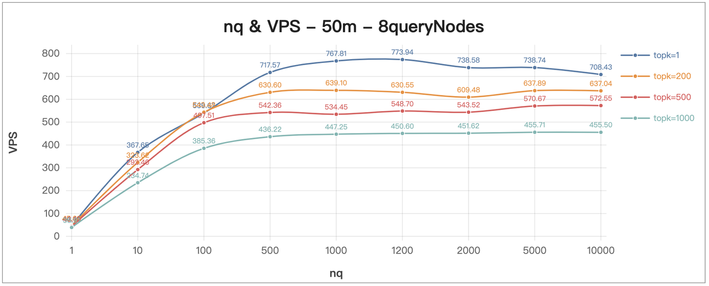
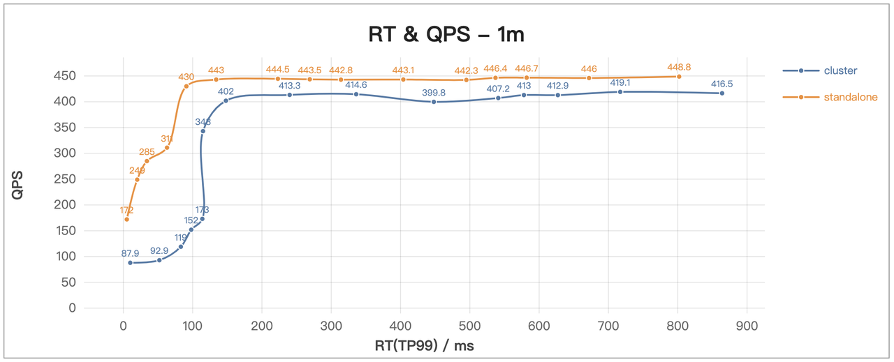
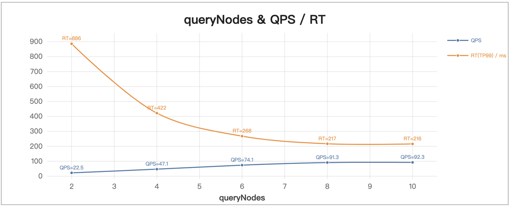
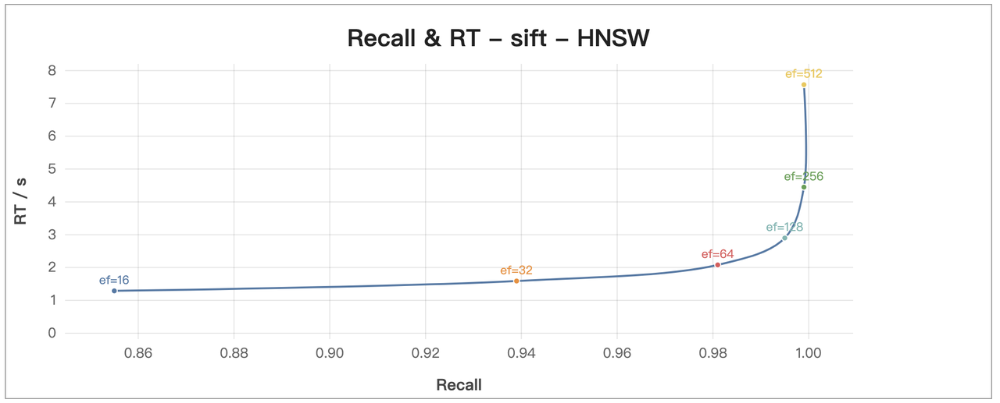
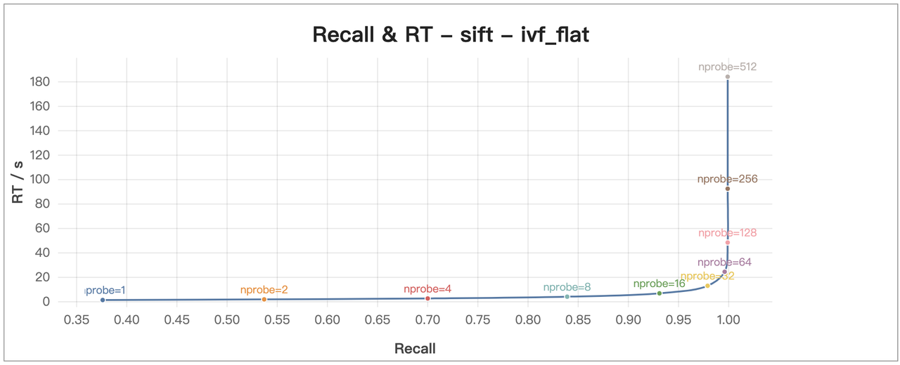
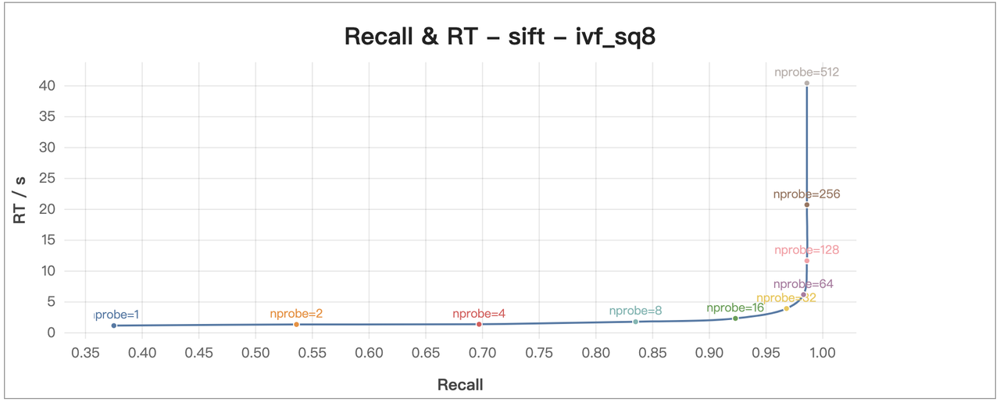

# Milvus 2.0 Benchmark Test Report

{{fragments/translation_needed.md}}

This report shows the major test results of Milvus 2.0, covering the performances of data inserting, index building, and vector similarity search. The tests aim to provide a benchmark against which the performances of future Milvus releases can be measured.

## Terminology

<details>
    <summary>Click to see the details of the terms used in the test</summary>
    <table class="terminology">
        <thead>
            <tr>
                <th>Term</th>
                <th>Description</th>
            </tr>
        </thead>
        <tbody>
            <tr>
                <td>NB</td>
                <td>Number of vectors in a batch insert request</td>
            </tr>
            <tr>
                <td>RT</td>
                <td>Response time from sending the request to receiving the response</td>
            </tr>
            <tr>
                <td>VPS</td>
                <td>Number of vectors that are successfully searched per second</td>		
            </tr>
            <tr>
                <td>QPS</td>
                <td>Number of search requests that are successfully processed per second</td>
            </tr>
            <tr>
                <td>Recall</td>
                <td>Rate of true nearest vectors retrieved in a search request</td>
            </tr>
            <tr>
                <td>nq</td>
                <td>Number of vectors to be searched in one search request</td>
            </tr>
            <tr>
                <td>topk</td>
                <td>Number of the nearest vectors to be retrieved for each vector (in nq) in a search request</td>
            </tr>
            <tr>
                <td>nprobe</td>
                <td>A search parameter specific to <a href="https://milvus.io/docs/v2.0.x/index.md">IVF indexes</a></td>
            </tr>
            <tr>
                <td>ef</td>
                <td>A search parameter specific to <a href="https://milvus.io/docs/v2.0.x/index.md">HNSW index</a></td>
            </tr>
        </tbody>
    </table>
</details>

## Test environment

All tests are performed under the following environments.

### Hardware environment

| Hardware | Specification                             |
| -------- | ----------------------------------------- |
| CPU      | Intel(R) Xeon(R) Gold 6226R CPU @ 2.90GHz |
| Memory   | DDR-4, 2933 MT/s                          |
| SSD      | SATA 6 GB/s                               |

### Software environment

| Software | Version    |
| -------- | ---------- |
| Milvus   | 2.0        |
| PyMilvus | 2.0.1.dev1 |

### Deployment scheme

- Milvus instance (standalone or cluster) in each test is deployed via [Helm](https://milvus.io/docs/v2.0.x/install_standalone-helm.md) on a Kubernetes cluster based on physical or virtual machines.
- Configurations of the tested Milvus instances merely vary in the number of CPU cores, the size of memory, and the number of replicas (worker nodes), which only applies to Milvus cluster.
- Unspecified configurations are [default configurations](https://github.com/milvus-io/milvus-helm/blob/master/charts/milvus/values.yaml)
- Milvus dependencies (MinIO, Pulsar, and etcd) store data on the local SSD in each node.
- PyMilvus is deployed on client end to send Python interface requests to the Milvus instances.

### Data sets

The tests use open source data sets SIFT (128 dimensions) and GloVe (200 dimensions) from [ANN-Benchmarks](https://github.com/erikbern/ann-benchmarks/#data-sets).

## Test pipeline

1. Start a Milvus instance by Helm with respective server configurations as listed in each test.
2. Connect the Milvus instance with PyMilvus, run the tests based on Python scripts, and get the corresponding test results.

## Test results

The tests covers the performances of data inserting, index building, and vector search in Milvus 2.0.

### Data inserting performance

This test aims to observe the correlation between NB and RT of data inserting.


<details>
    <summary><b>Method</b></summary>
    <ol>
        <li>Create a collection</li>
        <li>Insert the specified number (NB) of vectors (SIFT-128-dimension) consecutively</li>
        <li>Get the response time (RT) of the insert interface</li>
    </ol>
</details>

<details>
    <summary><b>Server configurations (cluster)</b></summary>

```yaml
dataNode:
    replicas: 1
    resources:
    limits:
        memory: 32Gi
        cpu: 8.0
        </code>
```

</details>




**Conclusion**

The larger the amount of data inserted at one time, the greater the response time.

**Suggestion**

It is recommended to insert less than 50,000 entries of (128-dimension) vectors at a single time. This will lead to lower delay and better stability.

### Index building performance

This test aims to observe the correlation between index building time and the number of the index nodes.

<details>
    <summary><b>Method</b></summary>
    <ol>
        <li>Create a collection</li>
        <li>Insert 50,000,000 entries of vectors (SIFT-128-dimemnsion)</li>
        <li>Build the specified type of index</li>
    </ol>
</details>

<details>
    <summary><b>Server configurations (cluster)</b></summary>

```yaml
dataNode:
    replicas: 1
    resources:
        limits:
            memory: 8Gi
            cpu: 2.0
indexNode:
    replicas: 1 / 2 / 4 / 6 / 8
    resources:
        limits:
            memory: 32Gi
            cpu: 8.0
        </code>
```

</details>

<details>
    <summary><b>Index details</b></summary>
    <table class="index-details">
        <thead>
            <tr>
                <th>Index type</th>
                <th>Index parameters</th>
            </tr>
        </thead>
        <tbody>
            <tr>
                <td>HNSW</td>
                <td><ul><li>M: 16</li><li>efConstruction: 500</li></ul></td>
            </tr>
            <tr>
                <td>IVF_FLAT</td>
                <td>nlist: 2048</td>
            </tr>
        </tbody>
    </table>
</details>


**Conclusion**

- With the same dataset and index type and parameter, the more index nodes, the shorter the time to create an index.
- With the same dataset and the specified index parameters, it takes longer time to build HNSW index than to build IVF_FLAT index.

**Suggestion**

For large data sets which are mostly stored in [sealed segments](glossary.md#Segment), the more index nodes in the cluster, the less time it takes to build an index.

### Vector search performance

The following tests observe the vector search of Milvus 2.0 from various perspectives.

#### nq & RT group by topk

This test observes the RT of search with different search parameters (nq & topk) under different data sets.

<details>
    <summary><b>Method</b></summary>
    <ol>
        <li>Create a collection</li>
        <li>Insert the specified number of vectors (SIFT-128-dimension)</li>
        <li>Build IVF_FLAT indexes with the specified parameters</li>
        <li>Search vectors in the collection with the specified parameters</li>
    </ol>
</details>

<details>
    <summary><b>Server configurations (cluster)</b></summary>

```yaml
dataNode:
    replicas: 1
    resources:
        limits:
            memory: 10Gi
            cpu: 2.0
indexNode:
    replicas: 1
    resources:
        limits:
            memory: 32Gi
            cpu: 8.0
queryNode:
    replicas: 1 / 4 / 8
    resources:
        limits:
            memory: 32Gi
            cpu: 8.0
        </code>
```

</details>

<details>
    <summary><b>Search details</b></summary>
    <table class="index-details">
        <thead>
            <tr>
                <th>Vector number</th>
                <th>Query node number</th>
                <th>Index parameter</th>
                <th>Search parameters</th>
            </tr>
        </thead>
        <tbody>
            <tr>
                <td>1,000,000</td>
                <td>1</td>
                <td>nlist: 2048</td>
                <td><ul><li>nprobe: 16</li><li>nq: 1, 10, 100, 500, 1000, 1200, 2000, 5000, 10000</li><li>topk: 1, 200, 500, 1000</li></ul></td>
            </tr>
            <tr>
                <td>50,000,000</td>
                <td>4</td>
                <td>nlist: 4096</td>
                <td><ul><li>nprobe: 16</li><li>nq: 1, 10, 100, 500, 1000, 1200, 2000, 5000, 10000</li><li>topk: 1, 200, 500, 1000</li></ul></td>
            </tr>
            <tr>
                <td>50,000,000</td>
                <td>8</td>
                <td>nlist: 4096</td>
                <td><ul><li>nprobe: 16</li><li>nq: 1, 10, 100, 500, 1000, 1200, 2000, 5000, 10000</li><li>topk: 1, 200, 500, 1000</li></ul></td>
            </tr>
        </tbody>
    </table>
</details>





**Conclusion**

- With the same dataset, the more query nodes, with the increase of nq or topk, the RT of search gradually increases.
- With the same dataset and search parameters, the more query nodes in the cluster, the lower the RT of the search.
- The smaller the data set, the lower the RT of the search.
- With the same search parameters, topk that is less than 200 makes little difference on RT of search.

**Suggestion**

For large data sets which are mostly stored in [sealed segments](glossary.md#Segment), adding query nodes to the cluster will shorten time it takes to search vectors.

#### nq & VPS group by topk

This test observes the VPS of search with different search parameters (nq & topk) under different data sets.

<details>
    <summary><b>Method</b></summary>
    <ol>
        <li>Create a collection</li>
        <li>Insert the specified number of vectors (SIFT-128-dimension)</li>
        <li>Build IVF_FLAT indexes with the specified parameters</li>
        <li>Search vectors in the collection with the specified parameters</li>
    </ol>
</details>

<details>
    <summary><b>Server configurations (cluster)</b></summary>

```yaml
dataNode:
    replicas: 1
    resources:
        limits:
            memory: 10Gi
            cpu: 2.0
indexNode:
    replicas: 1
    resources:
        limits:
            memory: 32Gi
            cpu: 8.0
queryNode:
    replicas: 1 / 4 / 8
    resources:
        limits:
            memory: 32Gi
            cpu: 8.0
        </code>
```

</details>

<details>
    <summary><b>Search details</b></summary>
    <table class="index-details">
        <thead>
            <tr>
                <th>Vector number</th>
                <th>Query node number</th>
                <th>Index parameter</th>
                <th>Search parameters</th>
            </tr>
        </thead>
        <tbody>
            <tr>
                <td>1,000,000</td>
                <td>1</td>
                <td>nlist: 2048</td>
                <td><ul><li>nprobe: 16</li><li>nq: 1, 10, 100, 500, 1000, 1200, 2000, 5000, 10000</li><li>topk: 1, 200, 500, 1000</li></ul></td>
            </tr>
            <tr>
                <td>50,000,000</td>
                <td>4</td>
                <td>nlist: 4096</td>
                <td><ul><li>nprobe: 16</li><li>nq: 1, 10, 100, 500, 1000, 1200, 2000, 5000, 10000</li><li>topk: 1, 200, 500, 1000</li></ul></td>
            </tr>
            <tr>
                <td>50,000,000</td>
                <td>8</td>
                <td>nlist: 4096</td>
                <td><ul><li>nprobe: 16</li><li>nq: 1, 10, 100, 500, 1000, 1200, 2000, 5000, 10000</li><li>topk: 1, 200, 500, 1000</li></ul></td>
            </tr>
        </tbody>
    </table>
</details>





**Conclusion**

- With the same data set and topk, VPS gradually increases with the increase of nq when nq is less than 1000; the VPS curve flattens when nq is greater than 1000.
- With the same dataset and search parameters, the more query nodes in the cluster, the higher the VPS of the search.
- The smaller the data set, the higher the VPS of the search.

**Suggestion**

- It is recommended to set the nq of each search no larger than 1000.
- Adding query nodes to the cluster will increase the VPS of the search.

#### RT & QPS

This test observes the correlation between QPS and RT of concurrent searches on Milvus standalone and cluster under the same data set.

<details>
    <summary><b>Method</b></summary>
    <ol>
        <li>Create a collection</li>
        <li>Insert 1,000,000 entries of vectors (SIFT-128-dimension)</li>
        <li>Build IVF_FLAT indexes with the same parameters</li>
        <li>Perform concurrent searches on the collection with the same parameters</li>
    </ol>
</details>

<details>
    <summary><b>Server configurations (cluster)</b></summary>

```yaml
dataNode:
    replicas: 1
    resources:
        limits:
            memory: 10Gi
            cpu: 2.0
indexNode:
    replicas: 1
    resources:
        limits:
            memory: 32Gi
            cpu: 8.0
queryNode:
    replicas: 1
    resources:
        limits:
            memory: 32Gi
            cpu: 8.0
        </code>
```

</details>

<details>
    <summary><b>Server configurations (standalone)</b></summary>

```yaml
standalone:
    resources:
        limits:
            memory: 64Gi
            cpu: 16.0
        </code>
```

</details>

<details>
    <summary><b>Search details</b></summary>
    <table class="index-details">
        <thead>
            <tr>
                <th>Vector number</th>
                <th>Index parameter</th>
                <th>Search parameters</th>
            </tr>
        </thead>
        <tbody>
            <tr>
                <td>1,000,000</td>
                <td>nlist: 2048</td>
                <td><ul><li>nprobe: 16</li><li>nq: 1</li><li>topk: 1</li></ul></td>
            </tr>
        </tbody>
    </table>
</details>



**Conclusion**

Search performance of Milvus Standalone is better than that of Milvus Cluster under the data set with one million entries vectors.

**Suggestion**

It is recommended to deploy Milvus standalone if the data set to search is small (less than one million entries of SIFT-128-dimension vectors) and there is no subsequent plan for scaling up the system.

#### Query node number & QPS or RT

This test observes the QPS and RT with different number of query nodes under the same data set.

<details>
    <summary><b>Method</b></summary>
    <ol>
        <li>Create a collection</li>
        <li>Insert the 50,000,000 entries of vectors (SIFT-128-dimension)</li>
        <li>Build IVF_FLAT indexes with the same parameters</li>
        <li>Perform concurrent searches on the collection with the same parameters</li>
    </ol>
</details>

<details>
    <summary><b>Server configurations (cluster)</b></summary>

```yaml
dataNode:
    replicas: 1
    resources:
        limits:
            memory: 10Gi
            cpu: 2.0
indexNode:
    replicas: 1
    resources:
        limits:
            memory: 32Gi
            cpu: 8.0
queryNode:
    replicas: 2 / 4 / 6 / 8 / 10
    resources:
        limits:
            memory: 32Gi
            cpu: 8.0
        </code>
```

</details>

<details>
    <summary><b>Search details</b></summary>
    <table class="index-details">
        <thead>
            <tr>
                <th>Vector number</th>
                <th>Index parameter</th>
                <th>Search parameters</th>
            </tr>
        </thead>
        <tbody>
            <tr>
                <td>50,000,000</td>
                <td>nlist: 4096</td>
                <td><ul><li>nprobe: 16</li><li>nq: 1</li><li>topk: 1</li></ul></td>
            </tr>
        </tbody>
    </table>
</details>



**Conclusion**

Under the same data set, when the number of query node increases, the QPS increases and RT decreases.

**Suggestion**

For large data sets which are mostly stored in [sealed segments](glossary.md#Segment), adding query nodes to the cluster will increase QPS.

#### Recall & RT group by ef or nprobe

This test observes the Recall and RT of search with different index types under different data sets.

<details>
    <summary><b>Method</b></summary>
    <ol>
        <li>Create a collection</li>
        <li>Insert the specified number of vectors (SIFT-128-dimension)</li>
        <li>Build IVF_FLAT or HNSW index with the specified parameters</li>
        <li>Search vectors in the collection with the specified parameters</li>
    </ol>
</details>

<details>
    <summary><b>Server configurations (cluster)</b></summary>

```yaml
dataNode:
    replicas: 1
    resources:
        limits:
            memory: 32Gi
            cpu: 8.0
indexNode:
    replicas: 1
    resources:
        limits:
            memory: 32Gi
            cpu: 8.0
queryNode:
    replicas: 1
    resources:
        limits:
            memory: 32Gi
            cpu: 8.0
        </code>
```

</details>

<details>
    <summary><b>Search details</b></summary>
    <table class="index-details">
        <thead>
            <tr>
                <th>Index type and parameters</th>
                <th>Vector type and number</th>
                <th>Search parameters</th>
            </tr>
        </thead>
        <tbody>
            <tr>
                <td>HNSW<ul><li>M: 16</li><li>efConstruction: 500</li></td>
                <td>1,000,000 (128-dimension-Euclidean)</td>
                <td><ul><li>ef: 16, 32, 64, 128, 256, 512</li><li>nq: 10000</li><li>topk: 10</li></ul></td>
            </tr>
            <tr>
                <td>IVF_FLAT<br/>nlist: 1024</td>
                <td>SIFT<br/>1,000,000 (128-dimension-Euclidean)</td>
                <td><ul><li>nprobe: 1, 2, 4, 8, 16, 32, 64, 128, 256, 512</li><li>nq: 10000</li><li>topk: 10</li></ul></td>
            </tr>
            <tr>
                <td>IVF_SQ8<br/>nlist: 1024</td>
                <td>SIFT<br/>1,000,000 (128-dimension-Euclidean)</td>
                <td><ul><li>nprobe: 1, 2, 4, 8, 16, 32, 64, 128, 256, 512</li><li>nq: 10000</li><li>topk: 10</li></ul></td>
            </tr>
            <tr>
                <td>IVF_FLAT<br/>nlist: 1024</td>
                <td>GloVe<br/> over 1,000,000 (200-dimension-Angular)</td>
                <td><ul><li>nprobe: 1, 2, 4, 8, 16, 32, 64, 128, 256, 512</li><li>nq: 10000</li><li>topk: 10</li></ul></td>
            </tr>
        </tbody>
    </table>
</details>






**Conclusion**

With the same data set and index type, as the nprobe/ef increases, the Recall gradually increases, and the RT also increases gradually.

**Suggestion**

- It is recommended to set the ef of each search no larger than 64 to achieve higher recall and lower RT when searching with HNSW index on SIFT data set.
- It is recommended to set the nprobe of each search no larger than 32 to achieve higher recall and lower RT when searching with IVF_FLAT or IVF_SQ8 index on SIFT data set.
- It is recommended to set the nprobe of each search no larger than 256 to achieve higher recall and lower RT when searching with IVF_FLAT index on GloVe data set.

#### Recall & RT group by index type

This test observes the Recall and RT of search with different index types on the same data set.


**Conclusion**

With the same data set and recall, the RT of search with HNSW index is lower, and that with IVF_FLAT index is higher.

**Suggestion**

It is recommended to search with HNSW index to have higher Recall and lower RT under the test condition specified above.

## Summary

- The larger the amount of data inserted at one time, the greater the response time.
- Increasing the number of index nodes can optimize index building performance.
- It is recommended to deploy Milvus standalone to search on small data set with less than 1,000,000 entries of vectors.
- The more vectors to search, the longer the search time.
- Increasing the number of query nodes can optimize search performance.
- The higher the recall of the search, the higher the response time of the search.