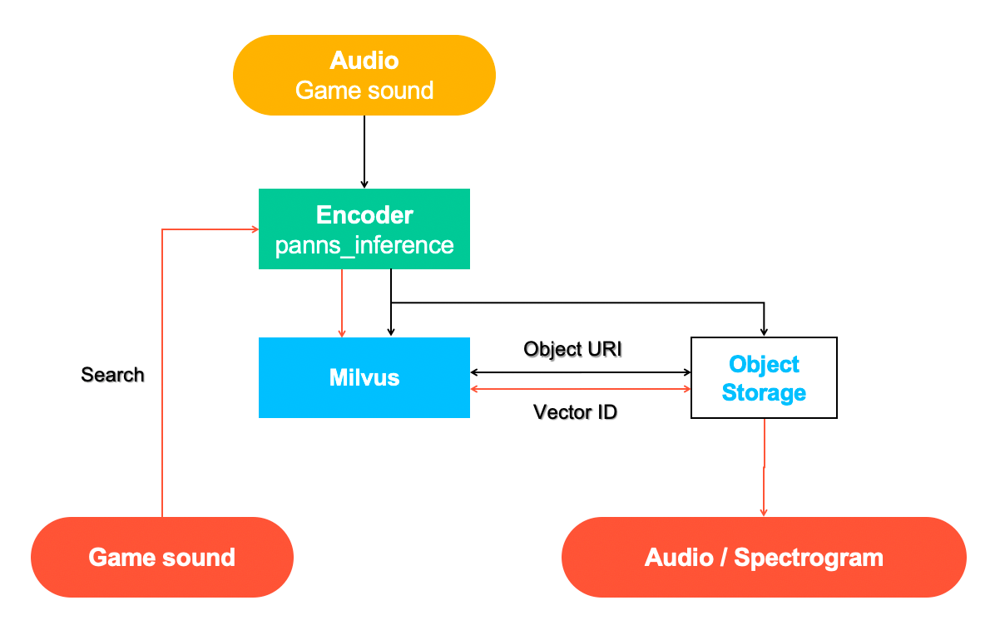
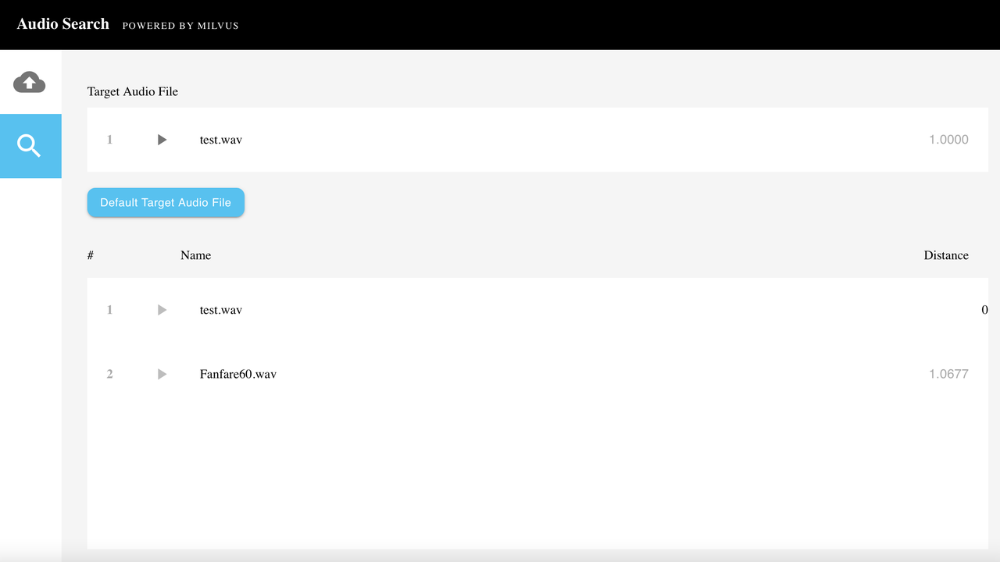

# 音频相似度检索

{{fragments/translation_needed.md}}

本教程将介绍如何使用开源向量数据库 Milvus 搭建音频相似度检索系统。

- [打开 Jupyter notebook](https://github.com/milvus-io/bootcamp/blob/master/solutions/audio_similarity_search/audio_similarity_search.ipynb)
- [快速部署](https://github.com/milvus-io/bootcamp/blob/master/solutions/audio_similarity_search/quick_deploy)
本教程中使用到的 ML 模型及第三方软件包括：
- PANNs (大规模预训练音频神经网络)
- MySQL

 

演讲，音乐，音效和其他类型的音频检索使得在海量的音频数据中查询并找出相似的声音成为可能。音频相似性检索系统的应用场景包括了识别相似的声音效果、最大限度地减少知识产权侵权等。音频检索还可以用于实时网络媒体的搜索和监控，来打击侵犯知识产权的行为。在音频数据的分类和统计分析中，音频检索也发挥着重要作用。

 

In this tutorial, you will learn how to build an audio similarity search system that can return similar sound clips. The uploaded audio clips are converted into vectors using PANNs. These vectors are stored in Milvus which automatically generates a unique ID for each vector. Then users can conduct a vector similarity search in Milvus and query the audio clip data path corresponding to th unique vector ID returned by Milvus.

在本教程中，你将学会如何构建一个音频检索系统，用来返回相似的声音片段。使用 PANN 将上传的音频片段转换为向量数据。这些向量存储在 Milvus 中，Milvus会自动为每个向量生成一个唯一的 ID。然后用户就可以在 Milvus 中进行向量相似度搜索，Milvus会返回一个唯一的向量ID，这个ID对应的音频片段数据的地址就是用户检索结果。

 

