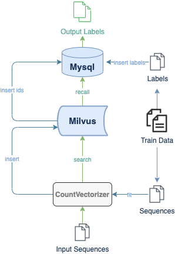

# DNA 序列分类

这个教程展示如何使用开源矢量数据库 Milvus 构建 DNA 序列分类模型。
- [开 Jupyter notebook](https://github.com/milvus-io/bootcamp/blob/master/solutions/dna_sequence_classification/dna_sequence_classification.ipynb)
- [快速部署](https://github.com/milvus-io/bootcamp/blob/master/solutions/text_search_engine/quick_deploy)
使用的 ML 模型和第三方软件包括:
- CountVectorizer
- MySQL

 

DNA 序列是个流行概念在基因可追溯性、物种鉴定、疾病诊断等领域里。随着个个行业渴望更智能、更高效的研究方法，人工智能备受关注，尤其是生物和医学领域。越来越多的科学家和研究人员正在贡献给生物信息学领域的机器学习和深度学习。为了使实验结果更具有说服力，一种常见的方法是增加样本量。基因组学与大数据的合作带来更多实际应用的可能性。然而，传统的序列比对存在局限性，不适用于大数据集。为了减少现实中的权衡，向量化是个好选择对于大型 DNA 序列数据集。

 

在这个教程中，你将学习如何构建 DNA 序列分类模型。这个教程使用 CountVectorizer 提取 DNA 序列特征并转换为向量。然后，这些向量存储在 Milvus 中，对应的 DNA 类存储在 MySQL 中。用户可以在 Milvus 中进行向量的相似性搜索，并从 MySQL 中调用对应的 DNA 分类。

 

