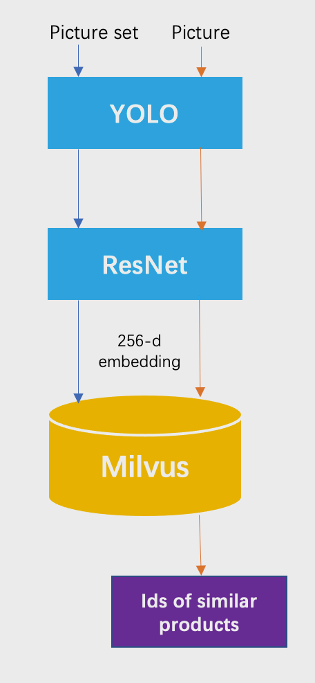
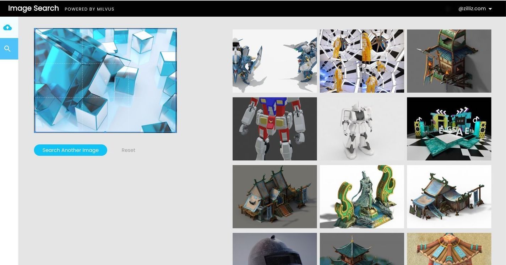

# 图像相似性检索 

{{fragments/translation_needed.md}}

本教程将介绍如何使用开源向量数据库 Milvus 搭建图像相似性检索系统。

- [打开 Jupyter notebook](https://github.com/milvus-io/bootcamp/blob/master/solutions/reverse_image_search/reverse_image_search.ipynb)
- [快速部署](https://github.com/milvus-io/bootcamp/blob/master/solutions/reverse_image_search/quick_deploy)
- [在线体验](https://zilliz.com/milvus-demos/reverse-image-search)
本教程中使用到的 ML 模型及第三方软件包括：
- YOLOv3
- ResNet-50
- MySQL

 

像谷歌这样的大型搜索引擎已经为用户提供了按图像搜索的选项。另外，电子商务平台已经意识到这个功能可以为网购者带来好处，所以亚马逊将图像搜索集成到了其智能手机应用程序中。

 

在本教程中，你将学会如何构建一个图像相似性检索系统，该系统可以检测图像的模式，并在你上传的图像中返回一个相似图像。要构建这样一个图像相似度搜索系统，请下载包含 20 个类别的 17125 张图像的 PASCAL VOC 图像数据集。使用 YOLOv3 进行目标检测，使用 ResNet-50 进行图像特征提取。 在经过两个 ML 模型之后，图像被转换为 256 维向量。 然后将向量存储在 Milvus 中，Milvus会自动为每个向量自动生成一个唯一的 ID。 然后使用 MySQL 将向量 ID 映射到数据集中的图像。 每当您将新图像上传到图像搜索系统时，它将被转换为新的矢量，并与之前存储在 Milvus 中的矢量进行比较。 然后 Milvus 返回最相似向量的 ID，您可以在 MySQL 中查询相应的图像。

 

