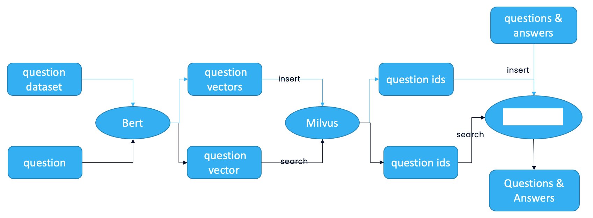
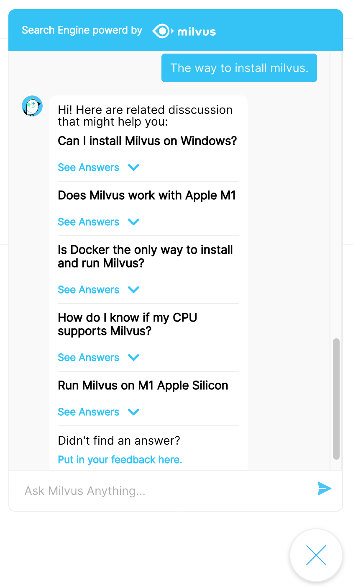

# 智能问答机器人

{{fragments/translation_needed.md}}

本教程将介绍如何使用开源向量数据库 Milvus 搭建智能问答（QA）系统。

- [打开 Jupyter notebook](https://github.com/milvus-io/bootcamp/blob/master/solutions/question_answering_system/question_answering.ipynb)
- [快速部署](https://github.com/milvus-io/bootcamp/blob/master/solutions/question_answering_system/quick_deploy)
- [在线体验](http://35.166.123.214:8005/)

本教程中使用到的 ML 模型及第三方软件包括：

- BERT
- MySQL

通过本教程，你将学习到如何搭建一个 QA 系统，该系统可以将新用户问题与之前存储在向量数据库中的大量答案相关联。 要构建这样的聊天机器人，请提前准备好自己的问题和相应的答案数据集。 将问题和答案存储在关系数据库 MySQL 中。 然后使用用于自然语言处理 (NLP) 的机器学习 (ML) 模型 BERT 将问题转换为向量。 这些问题向量在 Milvus 中存储和索引。 当用户输入一个新问题时，BERT 模型也会将其转换为一个向量，然后 Milvus 会搜索与这个新向量最相似的问题向量。 QA 系统对最相似的问题返回相应的答案。

 

